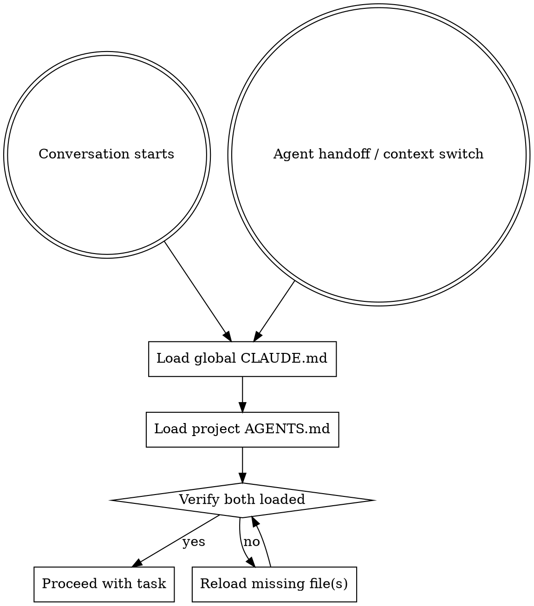

# Agent Context Loader

## Overview

Ensures the agent always operates with full awareness of user-level and project-level instructions. Global `CLAUDE.md` and project `AGENTS.md` must be loaded into context in full — never summarized, truncated, or skipped.

## When This Runs

## Loading Procedure

### Step 1: Load Global CLAUDE.md

Read the user's global `CLAUDE.md` in full:
- **Location:** `~/.claude/CLAUDE.md`
- **Required:** Yes — if missing, warn the user: "No global CLAUDE.md found at ~/.claude/CLAUDE.md. Create one to set persistent agent instructions."
- **Must be loaded in full** — never summarize or truncate

### Step 2: Load Project AGENTS.md

Read the project's `AGENTS.md` in full:
- **Location:** Project root (working directory)
- **Required:** No — if missing, continue silently
- **Must be loaded in full** — never summarize or truncate

### Step 3: Verify

After loading, confirm both files are in context:
- Global CLAUDE.md content is present and complete
- Project AGENTS.md content is present and complete (or confirmed absent)

## Verification Triggers

Re-verify and reload if necessary when ANY of these occur:
- A new conversation begins
- A subagent is dispatched or returns
- The main agent context is switched or compressed
- The working directory changes (reload project AGENTS.md)
- The user explicitly asks to reload context

## Rules

- **Never paraphrase** — load the raw file content, every line
- **Never skip** — even if the file was loaded earlier in the conversation, re-read after context switches
- **Never override** — instructions in these files take precedence over default behavior
- **CLAUDE.md takes priority** over AGENTS.md if they conflict
- **Both take priority** over skill defaults
- If a file is too large to fit in context, warn the user — do NOT silently truncate
