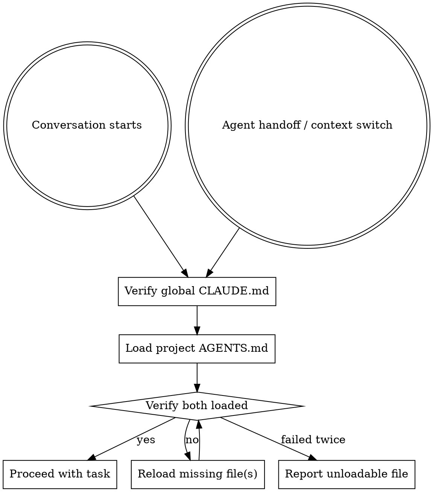

# Agent Context Loader

## Overview

Ensures the agent always operates with full awareness of user-level and project-level instructions. Global `CLAUDE.md` and project `AGENTS.md` must be loaded into context in full — never summarized, truncated, or skipped.

## When This Runs

```dot
digraph loader {
    "Conversation starts" [shape=doublecircle];
    "Agent handoff / context switch" [shape=doublecircle];
    "Verify global CLAUDE.md" [shape=box];
    "Load project AGENTS.md" [shape=box];
    "Verify both loaded" [shape=diamond];
    "Proceed with task" [shape=box];
    "Reload missing file(s)" [shape=box];
    "Report unloadable file" [shape=box];

    "Conversation starts" -> "Verify global CLAUDE.md";
    "Agent handoff / context switch" -> "Verify global CLAUDE.md";
    "Verify global CLAUDE.md" -> "Load project AGENTS.md";
    "Load project AGENTS.md" -> "Verify both loaded";
    "Verify both loaded" -> "Proceed with task" [label="yes"];
    "Verify both loaded" -> "Reload missing file(s)" [label="no"];
    "Verify both loaded" -> "Report unloadable file" [label="failed twice"];
    "Reload missing file(s)" -> "Verify both loaded";
}
```

## Loading Procedure

### Step 1: Verify Global CLAUDE.md

Global `CLAUDE.md` (`~/.claude/CLAUDE.md`) is auto-loaded by Claude Code into system context. Verify it's present — if the canary instruction response is missing, warn the user: "Global CLAUDE.md not detected in context."

Do NOT re-read this file if it's already in context — that wastes tokens.

### Step 2: Load Project AGENTS.md

Read the project's `AGENTS.md` in full:
- **Location:** Project root (working directory)
- **Required:** No — if missing, continue silently
- **Must be loaded in full** — never summarize or truncate

Do NOT re-read it if the launch directory's `CLAUDE.md` — either `./CLAUDE.md` or `./.claude/CLAUDE.md`, both of which Claude Code loads — carries a working import of `AGENTS.md` outside code spans and fenced blocks. The content is then already in context and re-reading wastes tokens. Verify it per Step 3 instead.

Two things make that exception narrower than it looks:
- **The import path must resolve.** It is relative to the file holding it, so `./CLAUDE.md` needs `@AGENTS.md` and `./.claude/CLAUDE.md` needs `@../AGENTS.md`. A wrong path loads nothing and says nothing.
- **It only covers the launch directory.** After a working-directory change, or for a directory added with `--add-dir` (whose `CLAUDE.md` is not loaded at all without `CLAUDE_CODE_ADDITIONAL_DIRECTORIES_CLAUDE_MD=1`), read that project's `AGENTS.md` directly.

When in doubt, read it. A redundant read costs tokens; a missing one costs correctness.

### Step 3: Verify

After loading, confirm both are in context:
- Global CLAUDE.md is present (check for canary response)
- Project AGENTS.md content is present and complete (or confirmed absent)

## Verification Triggers

Re-verify and reload if necessary when ANY of these occur:
- A new conversation begins
- A subagent is dispatched or returns
- The main agent context is switched or compressed
- The working directory changes (reload project AGENTS.md)
- The user explicitly asks to reload context

## Rules

- **Never paraphrase** — load the raw file content, every line
- **Never skip** — even if the file was loaded earlier in the conversation, re-read after context switches, except where the `@AGENTS.md` import already covers it (Step 2)
- **Never override** — instructions in these files take precedence over default behavior
- **CLAUDE.md takes priority** over AGENTS.md if they conflict — not because one is hand-written and the other generated, but by role: `~/.claude/CLAUDE.md` is the user's own standing instruction about how they want work done, while `AGENTS.md` is auto-detected context describing a codebase. A prohibition the user wrote for every project is not overridden by a fact discovered in one
- **Both take priority** over skill defaults
- If a file is too large to fit in context, warn the user — do NOT silently truncate
- **Bound the reload loop.** After two failed attempts on the same file, stop and tell the user which file could not be loaded and why. Retrying a file that is missing, unreadable, or oversized never converges
