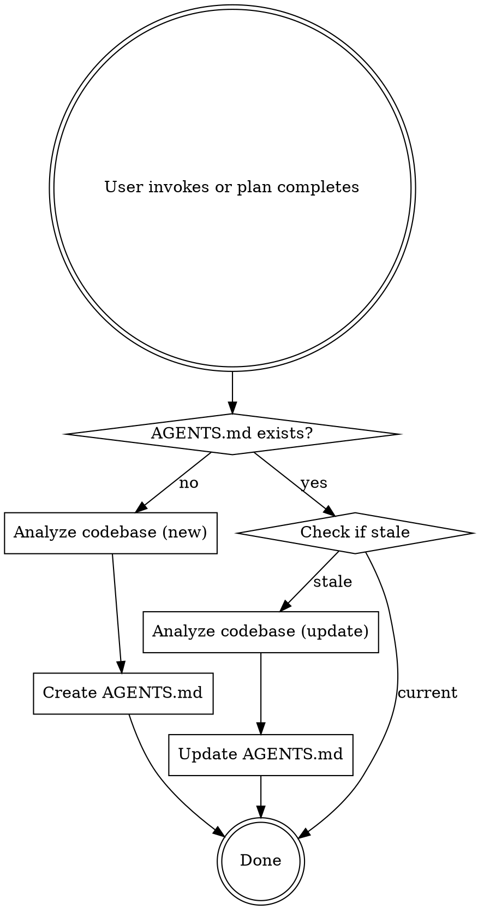

# AGENTS.md Manager

## Overview

Creates or updates the project's `AGENTS.md` file based on codebase analysis.

## When This Runs

- **Manually:** User invokes `/agents-md-manager`
- **Automatically:** As the final step after completing a superpowers plan execution (via `superpowers:executing-plans`)

This skill does NOT run automatically at conversation start.



## Staleness Detection

Re-analyze when ANY of these are true:
- `AGENTS.md` does not exist
- Tech stack versions in the file don't match `package.json` / `go.mod` / `Cargo.toml` / etc.
- Build/test/lint commands in the file don't match current scripts
- Project structure has significantly changed (new top-level directories)
- The user asks to refresh it

## What to Detect from Code

Scan these files to infer project context:

| Source | What to Extract |
|--------|----------------|
| `package.json` / `go.mod` / `Cargo.toml` / `*.csproj` / `requirements.txt` | Tech stack, versions, dependencies |
| `package.json` scripts / `Makefile` / `Taskfile` / CI configs | Build, test, lint commands |
| Directory listing | Project structure |
| Existing test files | Test framework, naming patterns, file locations |
| `.eslintrc` / `.prettierrc` / `biome.json` / `ruff.toml` | Linting and formatting config |
| `.env.example` / `.env.template` | Required environment variables |
| Existing code files | Naming conventions, patterns, style |

## What to Write

**Target: under 200 lines.** Every line must earn its place — ask "would removing this cause the agent to make mistakes?" If no, cut it.

### Required Sections (in order of priority)

**1. Project Overview (1-3 sentences)**
What it does, who it's for, tech stack with versions.
```markdown
## Project
E-commerce API built with Node.js 20, Express 4, TypeScript 5.4, PostgreSQL 16. Serves the mobile and web storefronts.
```

**2. Commands**
Exact build/test/lint commands with flags. Put these early — agents reference them constantly.
```markdown
## Commands
- Build: `npm run build`
- Test: `npm test -- --watch`
- Lint: `npm run lint -- --fix`
- Single test: `npm test -- --testPathPattern=<file>`
```

**3. Code Conventions (non-obvious only)**
Only include what differs from framework defaults or what the agent cannot infer from existing code.
```markdown
## Conventions
- Named exports only, no default exports
- Use ES modules (import/export), not CommonJS
- Error responses use `{ error: string, code: string }` shape
```

**4. Project Structure (key directories)**
```markdown
## Structure
- `src/api/` — Route handlers
- `src/services/` — Business logic
- `src/models/` — Database models
- `tests/` — Mirrors src/ structure
```

**5. Testing Approach**
Framework, naming, where tests live.

**6. Boundaries**
```markdown
## Boundaries
- **Always**: Run tests before committing
- **Ask first**: Database schema changes, dependency additions
- **Never**: Commit secrets, modify vendor/, force push to main
```

### Optional Sections (only if relevant)
- Domain terminology (business jargon definitions)
- Common workflows (step-by-step for recurring tasks)
- Environment setup quirks
- Common gotchas / past incident patterns

## What NOT to Write

| Exclude | Why |
|---------|-----|
| Things derivable from reading code | Wastes token budget |
| Standard language conventions | Agent already knows these |
| Detailed API docs | Link to them instead |
| Frequently changing data | Goes stale, poisons context |
| Vague principles ("write clean code") | Not actionable, gets ignored |
| File-by-file descriptions | Agent discovers through tools |
| Linting rules enforced by tools | "Never send an LLM to do a linter's job" |
| Secrets or credentials | Security risk |
| Contradicting instructions | Agent picks one arbitrarily |

## Writing Style Rules

- **Specific and verifiable**: "Use 2-space indentation" not "format properly"
- **Actionable**: Agent can execute without interpretation
- **Non-obvious**: Only things the agent wouldn't do by default
- **Include reasoning**: "Use pnpm (not npm) because we use pnpm workspaces" — the WHY helps edge cases
- **Show examples**: One code snippet beats three paragraphs
- **Most important rules first and last** — LLMs prioritize prompt peripheries

## Cross-Tool Compatibility

Generate `AGENTS.md` at project root — it's the universal format supported by 20+ tools (Claude Code, Cursor, Codex, Copilot, Windsurf, Kilo, etc.).

`CLAUDE.md` and `AGENTS.md` serve different purposes:
- **`CLAUDE.md`** — User-authored preferences and instructions (do not modify unless asked)
- **`AGENTS.md`** — Auto-detected project context (commands, structure, conventions)

Do NOT merge auto-detected content into `CLAUDE.md`. Always write to `AGENTS.md`. Never duplicate content that already exists in `CLAUDE.md`.

## User Notification

After creating or updating, briefly tell the user:
- "Created AGENTS.md with project context" (new file)
- "Updated AGENTS.md — added X, removed Y" (update)

Keep the notification to one line. Don't dump the file contents.
