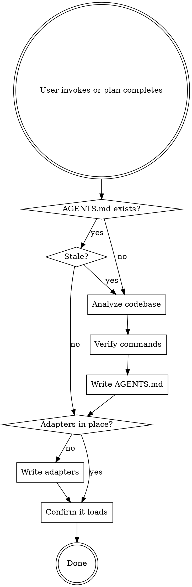

# AGENTS.md Manager

## Overview

Creates or updates the project's `AGENTS.md` file based on codebase analysis.

`AGENTS.md` is the cross-tool format for project instructions. Codex, Cursor, GitHub Copilot and 20+ other tools read it natively; a few — notably Claude Code and Gemini CLI — need a small adapter. Writing the file is only half the job — see [Make Sure It Loads](#make-sure-it-loads).

## When This Runs

- **Manually:** User invokes `/agents-md-manager`
- **Automatically:** As the final step after completing a superpowers plan execution (via `superpowers:executing-plans`)

This skill does NOT run automatically at conversation start.


```dot
digraph manager {
    "User invokes or plan completes" [shape=doublecircle];
    "AGENTS.md exists?" [shape=diamond];
    "Stale?" [shape=diamond];
    "Analyze codebase" [shape=box];
    "Verify commands" [shape=box];
    "Write AGENTS.md" [shape=box];
    "Adapters in place?" [shape=diamond];
    "Write adapters" [shape=box];
    "Confirm it loads" [shape=box];
    "Done" [shape=doublecircle];

    "User invokes or plan completes" -> "AGENTS.md exists?";
    "AGENTS.md exists?" -> "Analyze codebase" [label="no"];
    "AGENTS.md exists?" -> "Stale?" [label="yes"];
    "Stale?" -> "Analyze codebase" [label="yes"];
    "Stale?" -> "Adapters in place?" [label="no"];
    "Analyze codebase" -> "Verify commands";
    "Verify commands" -> "Write AGENTS.md";
    "Write AGENTS.md" -> "Adapters in place?";
    "Adapters in place?" -> "Write adapters" [label="no"];
    "Adapters in place?" -> "Confirm it loads" [label="yes"];
    "Write adapters" -> "Confirm it loads";
    "Confirm it loads" -> "Done";
}
```

## Staleness Detection

Re-analyze when ANY of these are true:
- `AGENTS.md` does not exist
- Tech stack versions in the file don't match the project's manifests
- Build/test/lint commands in the file don't match the project's current build tooling
- Project structure has significantly changed (new top-level directories)
- The user asks to refresh it

**Treat `AGENTS.md` as configuration, not documentation.** A stale file is obeyed with full confidence — wrong commands and dead conventions get followed to the letter. When a script, path, or directory moves, `AGENTS.md` changes in the same commit and goes through code review like any other config.

## What to Detect from Code

Scan these files to infer project context:

| Source | What to Extract |
|--------|----------------|
| Dependency manifests — `package.json`, `pyproject.toml`, `go.mod`, `Cargo.toml`, `pom.xml`, `build.gradle`, `Gemfile`, `composer.json`, `*.csproj`, `vcpkg.json`, … | Tech stack, versions, dependencies |
| Task definitions — manifest scripts, `Makefile`, `Taskfile`, `justfile`, `CMakeLists.txt`, CI configs, … | Build, test, lint commands |
| Directory listing | Project structure |
| Existing test files | Test framework, naming patterns, file locations |
| Linter and formatter config (`.eslintrc`, `ruff.toml`, `.golangci.yml`, `.editorconfig`, …) | Rules already enforced by tooling — exclude these from the file |
| `.env.example` / `.env.template` | Required environment variables |
| Existing code files | Naming conventions, patterns, style |
| `README` / `CONTRIBUTING` / `docs/` | What NOT to repeat — link to these instead |

That last row matters most. Where a repo already documents something, restating it doesn't help and isn't free: generated guidance shows no measurable improvement in task success in repos that already have docs while adding over 20% to inference cost, and the same guidance starts helping once those docs are stripped out. The agent spends context on your summary, then reads the source anyway.

## Verify Before Writing

How the guidance is produced — not whether it exists — is what decides whether it helps. Guidance refined against the repo it describes beats guidance generated once and shipped, at least where the agent's own output is diagnostic enough to refine against; shipped-as-generated barely beats no guidance at all, and in some settings does slightly worse. Unchecked files drift into commands and paths that no longer resolve, and agents follow what you write literally, including when it is wrong.

Before writing the Commands section:

1. **Run the terminating, read-only commands you are about to document** — build, test, lint, single-test.
2. **Never run what doesn't exit, can't be undone, or rewrites tracked source.** Dev servers and watch modes don't terminate; migrations, deploys and publishes can't be undone; formatters and `--fix` linters rewrite files the user has under version control. Build output is fine to write when it isn't tracked — `dist/`, `target/`, `bin/` are what a build is for. Some repos commit generated output, so check `git status` afterwards and say so if the build dirtied the tree. Verify the read-only form (`lint`, not `lint --fix`) even when the entry you document carries the writing flag. Where a bounded probe exists (`--help`, `--dry-run`, a list-only or collect-only mode), use that instead; otherwise mark the command inferred.
3. **Drop what fails** — unless it failed only because this environment lacks a service or credential. Then keep it and name the prerequisite inline: it's a real command, just not one runnable here.
4. **Never transcribe from the manifest alone.** A declared script or target can exist and still be broken.

Anything you inferred rather than executed gets called out to the user in your summary. Do not present it as verified.

## What to Write

**Target: under 200 lines.** Every line must earn its place — ask "would removing this cause the agent to make mistakes?" If no, cut it.

**The examples below come from different projects on purpose.** Always use the target project's own toolchain and layout: what matters is that every entry is exact and true of that repo, never which ecosystem the example happened to be drawn from.

### Core Sections (in order of priority)

Include each one unless that section's own test says to omit it.

**1. Project Overview (1-3 sentences)**
What it does, who it's for, tech stack with pinned versions. The versions are the part worth writing down — deriving them means opening manifests and reconciling them against whatever pins the actual versions. If the sentences restate the README's opening paragraph, cut them.
```markdown
## Project
Document indexing and search service for the internal knowledge base. Python 3.12, FastAPI 0.115, OpenSearch 2.17. Used by the support console and the staff wiki.
```

**2. Commands**
Exact build/test/lint commands with flags, each one verified per [Verify Before Writing](#verify-before-writing). Put these early — agents reference them constantly. The single-test entry earns its place in any language: running one test instead of the whole suite is the hardest invocation to guess and the one an agent needs most often.
```markdown
## Commands
- Build: `make build`
- Test: `go test ./...`
- Single test: `go test ./billing -run TestReconcile`
- Lint: `golangci-lint run` (add `--fix` to apply)
- Dev server: `make dev` (long-running; not executed during verification)
```

**3. Code Conventions (non-obvious only)**
Only include what differs from framework defaults or what the agent cannot infer from existing code. Write the rule, not the idiom — a convention that only makes sense in one language usually belongs in that language's linter instead. If nothing qualifies, omit the section.
```markdown
## Conventions
- Errors carry a stable `code` field; callers switch on it, never on message text
- Time values are UTC at every boundary; convert only for display
- Public API changes require a version bump in `api/VERSION`
```

**4. Project Structure (only what navigation cannot infer)**
What good guidance measurably buys is *reaching the right file*: it raises how often an agent produces a usable change while leaving the quality of that change flat. Treat that as the budget for this section — spend lines only where they shorten the path to the right file, and none where a directory listing already answers the question. A conventional `src/` and `tests/` tree earns nothing.

Include a directory only when one of these holds:
- Its name does not predict its contents
- A boundary between two similar-looking directories is load-bearing
- Editing it by hand would be wrong (generated code, vendored dependencies)

If nothing passes the test, omit the section. An empty `## Structure` heading is worse than none.

```markdown
## Structure
- `domain/` — Business rules. No framework or transport imports allowed here.
- `adapters/` — Everything that touches the network or disk.
- `proto/generated/` — Protobuf output. Regenerate with `make proto`; never hand-edit.
```

**5. Testing Approach**
Omit unless something here is non-obvious: a suite that needs a fixture server or seeded database, tests that don't live where the language puts them by default, a runner that isn't the ecosystem's usual one, or a required flag without which the suite misbehaves. Framework and file naming that an agent gets from scanning existing tests do not go here.

**6. Boundaries**
Always include this one. Name security-sensitive areas explicitly. Security appears in 14.8% of these files and performance in 14.5%: teams write enough to make agents functional and little to keep what they produce safe. This section is where that gap closes.
```markdown
## Boundaries
- **Always**: Run the Test command above before committing
- **Ask first**: Database schema changes, dependency additions
- **Never**: Commit secrets, hand-edit `proto/generated/`, force push to main
- **Security-sensitive**: `domain/auth/` and `domain/billing/` — never log request bodies; token handling changes need human review
```

### Optional Sections (only if relevant)
- Domain terminology (business jargon definitions)
- Common workflows (step-by-step for recurring tasks)
- Environment setup quirks
- Common gotchas / past incident patterns
- Commit and PR conventions — **only if no project `CLAUDE.md` already covers them**

## What NOT to Write

| Exclude | Why |
|---------|-----|
| Things derivable from reading code | Wastes token budget |
| Content already in README / CONTRIBUTING / `docs/` | Link instead — restating them adds cost without adding success |
| Standard language conventions | Agent already knows these |
| Detailed API docs | Link to them instead |
| Frequently changing data | Goes stale, poisons context |
| Vague principles ("write clean code") | Not actionable, gets ignored |
| File-by-file descriptions | Agent discovers through tools |
| Linting rules enforced by tools | "Never send an LLM to do a linter's job" |
| Secrets or credentials | Security risk |
| Contradicting instructions | Agent picks one arbitrarily |

## Writing Style Rules

- **Specific and verifiable**: "New endpoints must be registered in `routes/index` — the router does not autodiscover" not "wire up new endpoints properly". Pick rules a formatter or linter doesn't already enforce — those belong in tool config, not here.
- **Actionable**: Agent can execute without interpretation
- **Non-obvious**: Only things the agent wouldn't do by default
- **Include reasoning**: "Run tests through the project's task runner, not the test binary directly, because it sets required env vars" — the WHY helps edge cases
- **Show examples**: One code snippet beats three paragraphs
- **Most important rules first**

## Monorepo and Nested Files

Agents read the `AGENTS.md` nearest the file they are working on. Place one per subproject where conventions genuinely differ.

Merge semantics vary between agents — Codex concatenates root-to-cwd with closer files overriding, the spec and Copilot in the IDE take nearest-wins where nested discovery is enabled, and Copilot CLI combines them with no documented precedence order. Write nested files that are correct under every reading:

- **Self-contained for their subtree** — a nested file must make sense as the only one read
- **Never contradicting the root** — narrow or add, never reverse
- **Root holds only what is true everywhere** — move anything else down

Nested files are not free. Codex caps the entire concatenated chain at 32 KiB (`project_doc_max_bytes`) and stops loading once it hits the limit. Because it concatenates root-first, what gets dropped is the deepest file — the most specific one, closest to the work. Keep every file in the chain short, not just the root.

## Make Sure It Loads

Write `AGENTS.md` at the repository root. Not every agent reads it there, and the ones that don't fail silently.

| Agent | Reads `AGENTS.md`? | Adapter needed |
|-------|--------------------|----------------|
| OpenAI Codex | Yes — root to cwd, closer overrides | none |
| Cursor | Yes — root and subdirectories | none |
| GitHub Copilot | Yes — cloud agent, CLI, code review, and Chat; precedence varies by surface | none |
| Claude Code | **No** — reads `CLAUDE.md` | a `CLAUDE.md` importing `AGENTS.md` — path depends on which one, see below |
| Gemini CLI | **No** — reads `GEMINI.md` by default | `context.fileName` array in `.gemini/settings.json` (see below), or a `GEMINI.md` importing it |

Create an adapter only for agents the repo shows evidence of — `CLAUDE.md` or `.claude/`, `GEMINI.md` or `.gemini/`, `.cursor/`, `.github/copilot-instructions.md`. Don't scatter config for tools nobody uses.

The Claude Code adapter is one line at the top of the project's `CLAUDE.md`, with any Claude-specific instructions below it:

```markdown
@AGENTS.md
```

Add it to whichever file already exists — `./CLAUDE.md` or `./.claude/CLAUDE.md`. Adding that import line is the one change to `CLAUDE.md` you may make without being asked: it contributes no content of its own, and without it Claude Code never sees `AGENTS.md` at all. Creating `./.claude/CLAUDE.md` to hold nothing but that import is covered by the same permission, for the same reason. **Adding content to a `CLAUDE.md`, or creating a root `./CLAUDE.md` where none exists, is not — ask first.** Everything else about `CLAUDE.md` stays hands-off.

**A relative import resolves against the file that holds it, not the working directory.** Get this wrong and it fails silently — no error, no warning, just a file that never loads. Match the path to the file:

| Import lives in | Write |
|---|---|
| `./CLAUDE.md` | `@AGENTS.md` |
| `./.claude/CLAUDE.md` | `@../AGENTS.md` |

**Check where the file ends up, too.** If the root `CLAUDE.md` is itself distributed — a template the project tells people to copy to `~/.claude/CLAUDE.md`, a file it publishes or generates — an import written there breaks the moment it lands anywhere else, because it will resolve against the new location. Use `./.claude/CLAUDE.md` in that case: Claude Code loads both, so repo-specific wiring goes in one and the portable file stays portable.

Both failure modes are silent, which is why the load check below is not optional.

The Gemini CLI adapter is a settings key that takes an array. Keep every name already listed and add `AGENTS.md`:

```json
{ "context": { "fileName": ["AGENTS.md", "GEMINI.md"] } }
```

Never write it as a bare string — `"fileName": "AGENTS.md"` stops the repo's existing `GEMINI.md` from loading at all.

Once the import is in place, `AGENTS.md` reaches Claude Code at session launch as part of `CLAUDE.md`. It does not need a separate read.

After writing, confirm the file actually loads rather than assuming it. Prefer the loader's own record over asking a model what it loaded:

- **Claude Code** lists loaded memory files under `/context`.
- **Codex** logs its resolved chain — run with `codex -c log_dir=./.codex-log` and read `./.codex-log/codex-tui.log`.

A prompted check (`codex exec --sandbox read-only "Summarize the current instructions."` — use `exec`, because a bare `codex "..."` opens the interactive TUI and never returns) is a weaker fallback: it is the model's report, not the loader's, and it can omit a file without saying so. Never disable approvals just to read a file.

If the file isn't listed, the import path is wrong or the file sits somewhere that doesn't load — fix it before reporting done. Where you wrote nested files, check a subtree too: a chain that silently exceeded the 32 KiB cap looks identical to one that loaded, and that is exactly the case a model's summary is least able to catch.

## Scope, Not Authorship

`AGENTS.md` and a project `CLAUDE.md` are both team-shared project instructions, checked into version control. The personal-preferences layer is the home-directory file — `~/.claude/CLAUDE.md`, `~/.codex/AGENTS.md`. The split is scope, not who wrote it.

Two questions decide where a rule belongs:

- *Would it still be true in a different project?* → the user's home-directory file. **Never write there.**
- *Would it still be true under a different agent?* → `AGENTS.md` at the repo root.

Answering no to the first and yes to the second — true of this repo, true for any agent — is the `AGENTS.md` case. No to both, meaning specific to this repo *and* to one agent, belongs in the project `CLAUDE.md` below the import, not in `AGENTS.md`.

- **A project `CLAUDE.md` that already holds project rules** → leave it in place. Don't migrate it and don't restate it. Write only what it doesn't already say, and add the `@AGENTS.md` import so both load.
- **Never duplicate across the two.** Anything written twice goes stale in one place first, and the exclusion table's last row applies: contradicting instructions get resolved arbitrarily.

## User Notification

After creating or updating, briefly tell the user:
- "Created AGENTS.md with project context" (new file)
- "Updated AGENTS.md — added X, removed Y" (update)

Add one line for anything they need to act on: adapters you created, and any content you inferred but could not verify. Keep it short. Don't dump the file contents.
