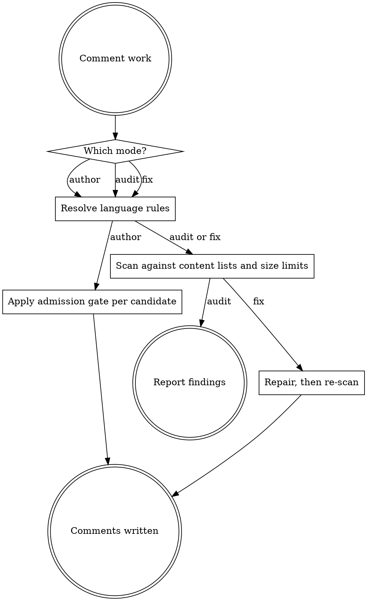

# Comment Manager

## Overview

Comment authoring, auditing and repair, across every language. Rules are derived from the
languages' own published guides plus Ousterhout, Clean Code, Code Complete, Google
engineering practices, CWE and OWASP — not from taste.

- Universal core: `references/comment-rules.md`
- Per-language deltas and the derived-language traps: `references/language-matrix.md`

Read both before writing a comment. The core binds everywhere; the matrix carries only what
genuinely differs between languages.

## The Admission Gate

<HARD-GATE>
A comment is written only after passing all three gates, in order.

1. **Necessity** — name the specific thing a competent reader of this language cannot
   recover from the code in about thirty seconds. Cannot name it? Do not write it.
2. **Irreducibility** — could clearer code remove the need? Rename, extract a function,
   introduce a named constant, replace a boolean parameter with an enum, gather options
   into a struct. If so, change the code instead.
3. **Durability** — will this still be true, and worth reading, after the next reasonable
   change?

**The default is no comment.** There is no minimum count, no comment-to-code ratio, and no
rule that a function, branch or loop earns a comment by existing. A demand for a comment
per construct — from a policy, a ticket, a reviewer or a user — does not survive Gate 1.
Say so and comment what actually needs it.

**Never invent a rationale.** If the reason is not in the code, the commit, the tests, the
tracker or the spec, you do not know it. Write nothing, or record the open question as a
tracked annotation.
</HARD-GATE>

## Modes



**Author** — fires on any code written or changed. **Audit** — scan a diff, file or tree and
report. **Fix** — repair, then re-scan.

<HARD-GATE>
**A secret in a comment is never fixed by deleting it.** Deleting the line removes it from
the working tree and from nowhere else — it remains in git history, in every clone, in CI
logs, and in anything already published. It is compromised from the moment it was
committed.

On finding a credential, key, token, connection string or private key in a comment:

1. Report it before changing anything.
2. State that it must be rotated or revoked and its history scrubbed.
3. Hand the finding to `necturalabs:iterative-security-audit`. This skill does not close a
   secret finding on its own.
4. Only then remove the line, and never present that removal as the remediation.

Fix mode must not delete a secret and re-scan clean. A clean re-scan over a deleted live
key is a false all-clear on a live exposure.
</HARD-GATE>

### Resolving language rules

1. Read the project's formatter configuration: `.editorconfig`, `rustfmt.toml`,
   `.prettierrc`, `checkstyle.xml`, `ruff.toml`, `.clang-format`, `scalafmt.conf`. It wins.
2. Read the language's row in `references/language-matrix.md` — width, doc marker, summary
   form, contract sections, tag policy, prohibitions. Read its "Doc Comment Required On"
   row too: what a language mandates documenting is looked up there, never reasoned about.
   If the language has no row, follow *Unlisted Languages* in the same file — an absent row
   is not a licence to document nothing.
3. **Check the derived-language trap table.** A language that borrows another's syntax
   rarely borrows its documentation conventions.
4. Apply the universal core unchanged.

## Reporting

One line per finding, matching `iterative-code-review` so audit output drops straight into
a review:

```
[SEVERITY] Comments: description — file:line
```

| Severity | Findings |
|---|---|
| CRITICAL | Comment contradicts the code; unverified rationale asserted as fact; credential, key, token, connection string or private key in a comment |
| HIGH | Internal hostname, internal path, infrastructure detail or PII in a comment; missing doc on public API; missing error, nullability, ownership, thread-safety or sentinel contract; commented-out code; annotation with no owner and no tracked reference; a security-scanner suppression with no justification and no tracked reference |
| MEDIUM | Restates the code; over the size limit; implementation detail in an interface comment; journal, byline or time-anchored language; wrong placement; wrong language convention |
| LOW | Punctuation, grammar, spacing, decorative boxes |

## Rationalizations

Every row was produced by an agent given a real commenting task without this skill.

| Rationalization | Reality |
|---|---|
| "Team policy says every exported function gets a comment" | A per-construct quota fails Gate 1 by construction. Comment what needs it and say why the rest does not. |
| "The threshold must be a loyalty perk, I'll write that" | You do not know that. An invented motive is a CRITICAL finding, not a helpful comment. |
| "It's unused now but it's there for future extensions" | Speculation about the future is unverifiable and reads as fact. Silence, or a tracked annotation. |
| "I'll note that callers shouldn't touch this directly" | An access convention is enforced by visibility, not prose. This does not extend to caller obligations — a safety contract, precondition or lock-ordering note is a fact about the contract and stays. |
| "A comment above the loop helps a new joiner follow it" | If the loop needs narrating, Gate 2 applies — rename or extract. `// Accumulate qty * unitPence` is the code, retyped. |
| "The private field deserves a note saying it's private" | The naming convention already says it. Restating a convention is noise. |
| "I'll summarise the steps in the doc comment" | A numbered walkthrough of the body is implementation detail in an interface comment. |
| "It's under-documented, so more comments is an improvement" | Under- and over-commenting are both defects. The cure for one is not the other. |
| "I'll describe what each parameter is" | Only where the name and type do not carry it. `customer_id: ID of the customer` is the parameter name, retyped. |
| "Close enough on the mechanism" | `int(x / y)` is not integer division. A comment that is nearly right is wrong, and it will be believed. |

## Red Flags

- You are about to write a comment and cannot name what it tells a reader that the code does not.
- The comment paraphrases the line beneath it.
- You are writing *why* and cannot cite where you learned it.
- The words *currently*, *for now*, *new*, *recently*, *probably*, *should*, or *in future* appear.
- You are adding comments to satisfy a count, a policy, or a reviewer's blanket request.
- The doc comment explains how the body works.
- You reached for the doc syntax of the language this one resembles.
- A comment directs the reader to act outside the code's contract. A caller obligation — a
  safety requirement, a precondition, a lock that must be held — is not this, and is never
  deleted on these grounds.

**All of these mean: stop. Re-run the admission gate, or fix the code instead.**

## Anti-Laziness Rules

- **Never skip the matrix lookup** because the language "looks like" one you know.
- **Never leave a stale comment** on code you touched. Editing code means you own its comments.
- **Never defer a comment finding.** No TODOs for it, no follow-ups, no "out of scope".
- **Never weaken a comment to prose vagueness** to avoid stating a contract you would have to verify — verify it.
- **Never delete a comment you do not understand** without first establishing it is wrong.
