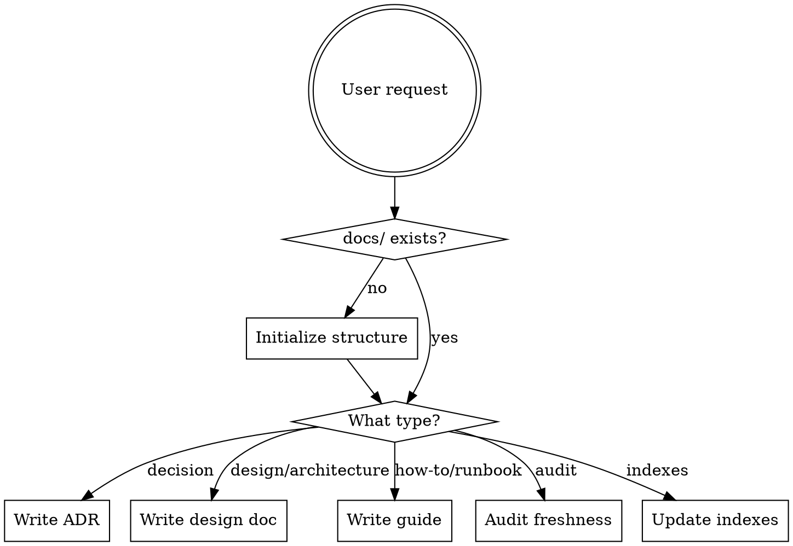

# Documentation Manager

## Overview

Creates and maintains a project's `docs/` folder following industry-standard practices: Diataxis framework for document types, MADR for architecture decisions, Google-style design docs, and docs-as-code principles.

## When to Use

- User asks to set up project documentation
- User asks to write an ADR or design doc
- User asks to audit or update documentation
- User asks to document a decision, design, or system
- After significant implementation work that changed system behavior

## Scope Detection

Before acting, determine what the user needs:



## Directory Structure

Use a **scale-adaptive** layout. Do NOT create empty directories upfront. Create directories only when the first document of that type is written.

```
docs/
  index.md                      # Root table of contents (always present)
  decisions/                    # ADRs — create when first ADR is written
    index.md
    0001-kebab-case-title.md
  design/                       # Design docs AND architecture overviews
    index.md
    0001-kebab-case-title.md
  guides/                       # How-to guides, runbooks, onboarding
    index.md
    kebab-case-title.md
  reference/                    # Research, reference material, specs
    index.md
    kebab-case-title.md
```

### Why this structure

- **`decisions/` and `design/` are separate** because ADRs are append-only records with strict lifecycle rules, while design docs are living documents that get updated.
- **`architecture/` is merged into `design/`** to avoid boundary blur in small-to-medium projects. Architecture overviews are design documents.
- **`guides/` covers all task-oriented docs** — onboarding, deployment, debugging, runbooks. Diataxis calls these "how-to guides."
- **`reference/` covers non-generated reference material** — research, external specs, data models. Auto-generated API docs do NOT go here.

## Initialization

When `docs/` does not exist, create the minimal structure:

1. Create `docs/index.md` with the root index template
2. Ask the user what they need first (ADR, design doc, guide, or full audit)
3. Create only the directories needed for that first document

### Root Index Template

```markdown
# Project Documentation

## Sections

<!-- Add links as directories are created -->

## Conventions

- All docs use Markdown (`.md`)
- File names use `kebab-case`
- ADRs use `NNNN-kebab-case-title.md` numbering
- Every directory has an `index.md`
- Documents include `last-reviewed` date in frontmatter
```

## Document Types

### Architecture Decision Records (ADRs)

**Location:** `docs/decisions/NNNN-kebab-case-title.md`

**When to write an ADR:**
- A trade-off was made between viable alternatives
- The decision affects system architecture or quality attributes
- Future developers will need to understand "why"
- The decision crosses team or module boundaries

**When NOT to write an ADR:**
- Trivial, short-lived, or easily reversible decisions
- Already covered by established project standards
- Temporary workarounds or proofs of concept

**Format (MADR 4.0):**

Use the template at `templates/adr-template.md`. Required sections:

| Section | Purpose |
|---------|---------|
| **Title** | Short, problem-focused (not solution-focused) |
| **Status** | `proposed` / `accepted` / `deprecated` / `superseded by ADR-NNNN` |
| **Date** | YYYY-MM-DD |
| **Context** | 2-3 sentences describing the problem and constraints |
| **Considered Options** | Bulleted list of alternatives |
| **Decision Outcome** | "Chosen option: X, because..." with justification |

Optional sections: Decision Drivers, Pros/Cons per option, Consequences, Related ADRs.

**Lifecycle rules:**
- ADRs are **append-only** — never delete or silently modify accepted ADRs
- When superseded: mark status as `superseded by [ADR-NNNN](NNNN-title.md)` and create the new ADR
- When deprecated: mark status as `deprecated` with a date and reason
- Link both forward and backward between related/superseding ADRs

**Numbering:** Sequential, zero-padded to 4 digits. Check existing ADRs and use next available number.

### Design Documents

**Location:** `docs/design/NNNN-kebab-case-title.md`

**When to write a design doc** (Google's litmus test — write one if 3+ apply):
- Uncertainty about the right approach warrants investigation
- The design involves trade-offs that should be documented
- Cross-cutting concerns (security, performance) need attention
- Future engineers need high-level understanding of the system
- Multiple components or modules are affected

**Format:**

Use the template at `templates/design-doc-template.md`. Required sections:

| Section | Purpose |
|---------|---------|
| **Context and Scope** | Brief overview of the problem landscape |
| **Goals and Non-Goals** | Explicit bullet lists of what this will and will NOT do |
| **Design** | The actual design — start high-level, then details. Include diagrams. |
| **Alternatives Considered** | Viable alternatives with trade-offs explaining rejection |
| **Cross-Cutting Concerns** | Security, performance, observability, backward compatibility |

Optional: Implementation Plan, Open Questions, References.

**Numbering:** Sequential like ADRs, but in its own sequence within `design/`.

### How-To Guides

**Location:** `docs/guides/kebab-case-title.md`

**When to write a guide:**
- A task requires multiple steps that aren't obvious
- New contributors need to set up their environment
- Operational procedures (deployment, incident response, debugging)
- Common workflows that team members ask about repeatedly

**Format:** Task-oriented. Start with the goal, list prerequisites, then numbered steps. No theory — link to explanatory docs for background.

### Reference Material

**Location:** `docs/reference/kebab-case-title.md`

**What goes here:**
- Research results that informed decisions
- External specifications or standards summaries
- Data model documentation (when not auto-generated)
- Configuration reference (when not inline)

**What does NOT go here:**
- Auto-generated API docs (those go in build output)
- Per-module READMEs (those stay in the module directory)
- Inline code documentation (that stays in source)

## Document Frontmatter

Every document in `docs/` MUST have YAML frontmatter:

```yaml
---
title: Document Title
type: adr | design | guide | reference
status: draft | active | deprecated | superseded  # ADRs/design docs only
date: YYYY-MM-DD                                   # Creation date
last-reviewed: YYYY-MM-DD                          # Last review date
---
```

## Index Maintenance

Every `docs/` subdirectory MUST have an `index.md` that links to all documents within it. Format:

```markdown
# Section Title

| Document | Status | Date | Description |
|----------|--------|------|-------------|
| [NNNN Title](NNNN-file.md) | accepted | 2026-01-15 | One-line summary |
```

**When to update indexes:**
- After adding, renaming, or removing any document
- After changing a document's status
- The root `docs/index.md` links to all subdirectory indexes

## Staleness Prevention

### Rules

1. **Incorrect docs are worse than missing docs** — if a document is wrong, fix it or mark it deprecated immediately
2. **`last-reviewed` dates are mandatory** — every document must have one
3. **Review cadence** — documents should be reviewed when the code they describe changes, not on a calendar schedule
4. **Code + docs in the same commit** — when implementation changes system behavior, update the relevant docs in the same PR/commit
5. **Flag, don't ignore** — if you encounter stale docs during other work, either fix them or create an issue

### Lifecycle Policy

Documents go through these states:

```
draft → active → deprecated (or superseded)
```

**When to archive/retire:**
- A feature or system the doc describes has been removed → mark `deprecated`
- A decision has been reversed → mark `superseded by [new ADR]`
- A guide describes a workflow that no longer exists → delete (it's in git history)
- When a directory accumulates >20 documents, consider splitting into subdirectories by domain

**Consolidation:** When related ADRs or design docs accumulate around the same system, write a summary design doc that synthesizes the current state and link the individual ADRs from it.

## What Does NOT Belong in `/docs`

| Document | Correct Location |
|----------|-----------------|
| README | Repository root |
| CHANGELOG | Repository root |
| CONTRIBUTING | Repository root |
| LICENSE | Repository root |
| CODE_OF_CONDUCT | Repository root |
| Inline API docs | Source code comments |
| Generated API reference | Build output or hosted site |
| Per-module READMEs | In the module directory |
| CI/CD config docs | Inline in CI config files |
| Commit conventions | Root-level files (CLAUDE.md, AGENTS.md) |

## Cross-Referencing Rules

1. **Internal links use relative paths** — `[ADR-0003](../decisions/0003-use-react.md)`, never absolute paths
2. **Reference code by module/function name**, not line number (line numbers drift)
3. **ADRs reference related ADRs** bidirectionally in a "Related" section
4. **Design docs link to ADRs they implement** or that motivated them
5. **Code comments reference docs** when the "why" lives in a doc: `// See docs/decisions/0003-use-react.md`

## Audit Mode

When the user asks to audit documentation, check:

1. **Structure** — does `docs/` follow the directory layout? Are indexes present?
2. **Frontmatter** — does every doc have required frontmatter fields?
3. **Staleness** — are any `last-reviewed` dates older than 6 months? (Fallback threshold; primary trigger is when related code changes)
4. **Orphans** — are there docs not linked from any index?
5. **Dead links** — do all internal cross-references resolve?
6. **Coverage** — are there significant architectural decisions or systems without corresponding docs?
7. **Consistency** — do file names follow kebab-case? Are ADRs sequentially numbered?

Report findings in a summary table:

```
## Documentation Audit

| Check | Status | Details |
|-------|--------|---------|
| Structure | PASS/FAIL | ... |
| Frontmatter | PASS/FAIL | X docs missing fields |
| Staleness | WARN | X docs not reviewed in >6 months |
| Coverage | INFO | These systems lack documentation: ... |
```

## Anti-Laziness Rules

- **Never create empty placeholder docs** — every document must have real content
- **Never skip index updates** when adding or removing documents
- **Never omit frontmatter** — it's required, not optional
- **Never put docs in the wrong directory** — ADRs go in decisions/, not design/
- **If unsure about document type, ask the user** — don't guess
