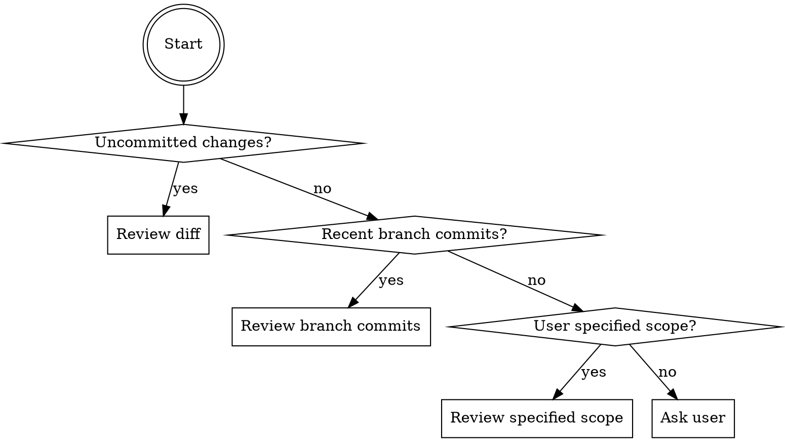
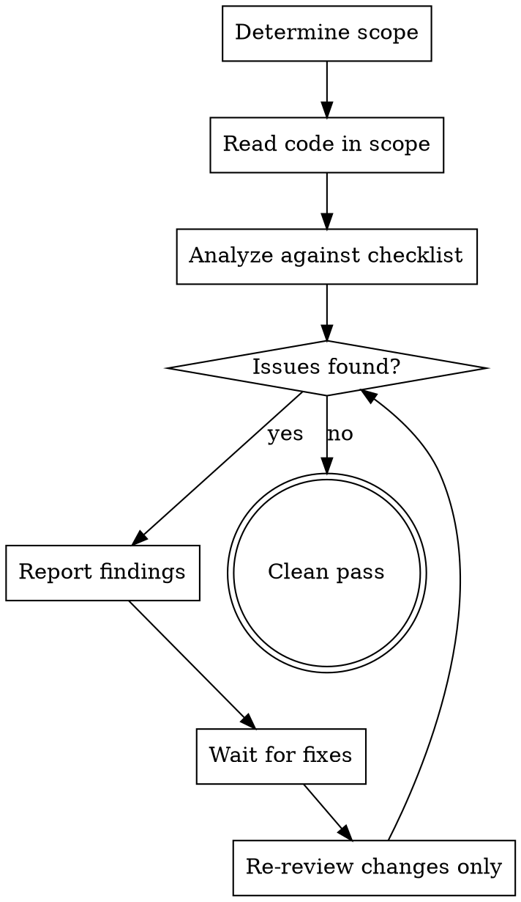

# Iterative Code Review

## Overview

Perform thorough, iterative code reviews that continue until all issues are resolved and a clean pass is achieved. Automatically infers review scope from context.

## Scope Detection



1. Check `git diff` and `git diff --staged` for uncommitted changes
2. If none, check `git log` for recent commits on current branch vs base branch
3. If user specified files or directories, use that scope
4. If ambiguous, ask: "Should I review recent changes or the full codebase?"

## Review Process



## Review Checklist

| Category | What to Check |
|----------|---------------|
| **Correctness** | Logic errors, off-by-one, null/undefined handling, edge cases, race conditions |
| **Error Handling** | Missing try/catch, unhandled rejections, silent failures, swallowed errors |
| **Naming** | Unclear names, misleading names, inconsistent conventions |
| **Complexity** | Functions doing too much, deep nesting, unnecessary abstractions, god objects |
| **Duplication** | Copy-paste code, patterns that should be shared |
| **Performance** | N+1 queries, unnecessary re-renders, missing indexes, algorithmic inefficiency |
| **Types** | Missing types, overly broad types (`any`), incorrect assertions |
| **API Design** | Inconsistent interfaces, breaking changes, missing validation at boundaries |
| **Testing** | Missing tests for new logic, untested edge cases, brittle test setup |
| **Dead Code** | Unused imports, unreachable branches, commented-out code |

## Reporting Format

For each finding:

```
**[SEVERITY] Category: Brief description**
File: path/to/file.ext:line
Issue: What's wrong
Suggestion: How to fix
```

Severities:
- **CRITICAL** — Will cause bugs, data loss, or crashes
- **HIGH** — Significant quality issue that should be fixed
- **MEDIUM** — Should be fixed but not blocking
- **LOW** — Style or preference, optional

## Clean Pass Criteria

A clean pass requires:
- Zero CRITICAL or HIGH findings
- All MEDIUM findings acknowledged or fixed
- LOW findings noted but not blocking

Report: **"Clean pass — no issues found"** when complete.

## Iteration Rules

- Each iteration reviews ONLY changes made since last review, not the full scope again
- New issues introduced by fixes count as new findings
- Maximum 5 iterations — if not clean by then, summarize remaining issues and stop
- Track iteration count: "Review iteration 2/5"
- If the same finding reappears after being "fixed", escalate its severity one level
