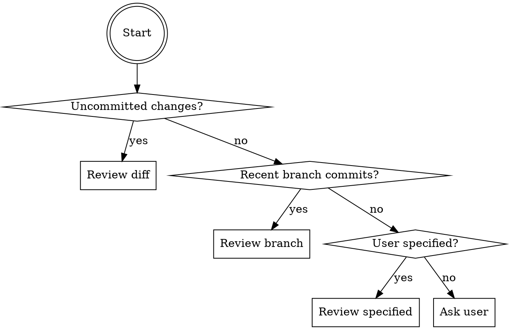
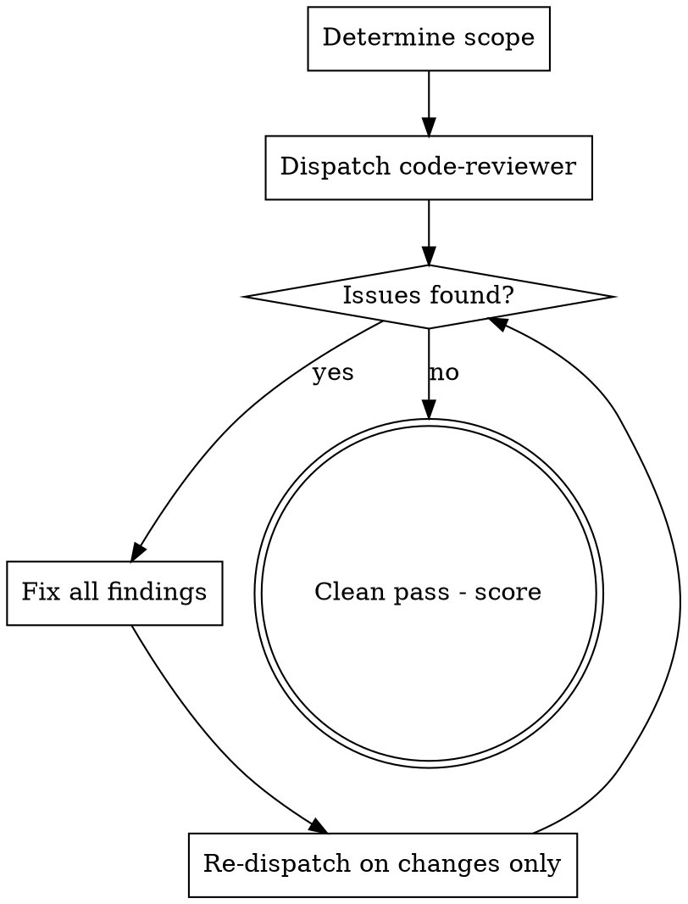

# Iterative Code Review

## Overview

Industry-standard code review powered by `superpowers:code-reviewer`. Reviews against Google Engineering Practices, Clean Code (Robert C. Martin), SOLID principles, Martin Fowler's code smells, and testing standards from Google SWE Book, Kent Beck, and Microsoft. Iterates until clean.

<HARD-GATE>
This skill REQUIRES `superpowers` to be installed. If not available, tell the user:
"Install superpowers first: `/plugin marketplace add obra/superpowers` then `/plugin install superpowers@superpowers-dev`"
Do NOT proceed without it.
</HARD-GATE>

## Security Audit Gate

<HARD-GATE>
**BEFORE reviewing, check if changes are security-related** (auth, crypto, input validation, API endpoints, sessions, secrets, dependencies — see `iterative-security-audit` for the full list). If yes AND the security audit has not already run in this invocation chain, **STOP** — invoke the security audit first. It chains into code review with `AUDIT_COMPLETE` in context.

If the security audit already ran (look for `AUDIT_COMPLETE` in the invocation context), proceed normally.
</HARD-GATE>

## Scope Detection



1. `git diff` + `git diff --staged` for uncommitted changes
2. `git log` for branch commits vs base
3. User-specified scope
4. If ambiguous: **ask the user** — never guess

## Review Process



### How to Dispatch

Use the `superpowers:code-reviewer` agent with these placeholders filled:

```
WHAT_WAS_IMPLEMENTED: [describe changes]
PLAN_OR_REQUIREMENTS: Review against the checklist in references/review-checklist.md and references/testing-rules.md
BASE_SHA: [git rev-parse for scope start]
HEAD_SHA: [git rev-parse HEAD]
DESCRIPTION: [brief summary]
```

**Inject our review checklist** into the plan/requirements field so the code-reviewer agent reviews against OUR standards, not just its defaults.

## Review Checklist (Summary)

Full detailed checklist: `references/review-checklist.md`

| Category | Source | Key Checks |
|----------|--------|------------|
| Design & Architecture | Google, SOLID | SRP, OCP, LSP, ISP, DIP, Law of Demeter |
| Complexity | McCabe, SonarQube | Cyclomatic <10, Cognitive <15, Nesting <3, Params <4 |
| Code Smells | Fowler, Refactoring.Guru | Bloaters, OO abusers, change preventers, dispensables, couplers |
| Naming | Clean Code, Google | Descriptive, unambiguous, consistent vocabulary |
| Functions | Clean Code | Small, one thing, no side effects, no flag args |
| Error Handling | Clean Code, OWASP | No swallowed exceptions, specific catches, proper cleanup |
| Testing | Google SWE, Kent Beck, Microsoft | See `references/testing-rules.md` |
| Performance | Google, SonarQube | Resource cleanup, N+1, proper data structures |
| Concurrency | Java Concurrency Checklist | Protected shared state, no deadlocks, proper sync |
| DRY/KISS/YAGNI | Industry Standard | No duplication, no over-engineering, no speculation |
| Style | Google/Airbnb Guides | Follow project conventions, no mixed style+logic PRs |
| API Design | Google API Guide | Backward compat, proper HTTP, consistent errors |

## Testing Rules (Summary)

Full detailed rules: `references/testing-rules.md`

**Critical rules the agent MUST follow when writing or reviewing tests:**

1. **Test YOUR code's logic, not external libraries/services** — mock externals at boundaries
2. **Reuse existing codebase helpers** — never fabricate parallel implementations
3. **Every test must be able to fail** — no tautological assertions
4. **No logic in tests** — use literal expected values, no loops/conditionals
5. **Test behavior through public APIs** — never break encapsulation
6. **One behavior per test** — if name has "and", split it
7. **Arrange-Act-Assert** — clear separation, one Act per test
8. **Don't mock what you don't own** — wrap externals, mock the wrapper
9. **Don't over-mock** — if more mocks than test logic, refactor production code
10. **Every production bug gets a regression test**

## Reporting

Keep ALL output short and concise. Never overwhelm the user.

### Per-Finding Format (one line each)
```
[SEVERITY] Category: description — file:line
```

### Severities
- **CRITICAL** — Bugs, data loss, crashes. Must fix.
- **HIGH** — Design flaws, missing tests. Should fix.
- **MEDIUM** — Quality issues. Fix preferred.
- **LOW** — Style, optional improvements.
- **INFO** — Educational notes, no action needed.

## Iteration Rules

- Each iteration reviews ONLY changes since last review
- New issues from fixes = new findings
- Recurring finding after fix = escalate severity one level
- **Max 5 iterations** — summarize remaining if not clean
- Track: "Review iteration 2/5"
- **Never skip, delay, defer, or postpone ANY finding** — every finding must be fully resolved within the review scope. No TODOs, no "address in a follow-up", no "out of scope" dismissals, no "note for later". The only exception is an explicit user instruction to skip a specific finding.
- **Double-check every finding** against codebase context and online references

## Final Summary (after clean pass)

```
## Code Review: Score X/100

**Positives**
- [concise bullet]
- [concise bullet]

**Negatives**
- [concise bullet]

**Informational**
- [optional notes]
```

Score guide: 90-100 excellent, 70-89 good, 50-69 needs work, <50 significant issues.

## Anti-Laziness Rules

- **Never substitute a manual scan for this skill** — reading the diff yourself and saying "looks clean" is not a code review. Invoke this skill.
- **Never say "looks good" without checking every file**
- **Never skip a category** from the checklist
- **Never mark a finding as LOW to avoid fixing it** — severity must reflect actual impact
- **If unsure about a finding, ASK the user** — don't guess or skip
- **Verify findings in the actual code** — don't report phantom issues
- **Never rationalize deferral** — "we can fix this later", "out of scope", "low priority for now" are all unacceptable. Fix it or get explicit user approval to skip
