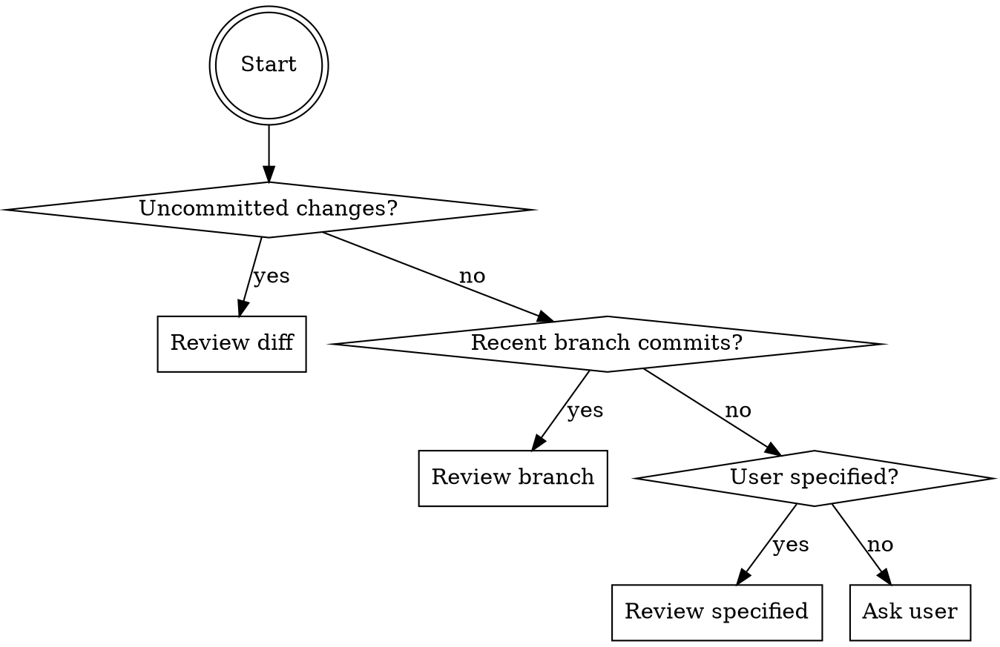
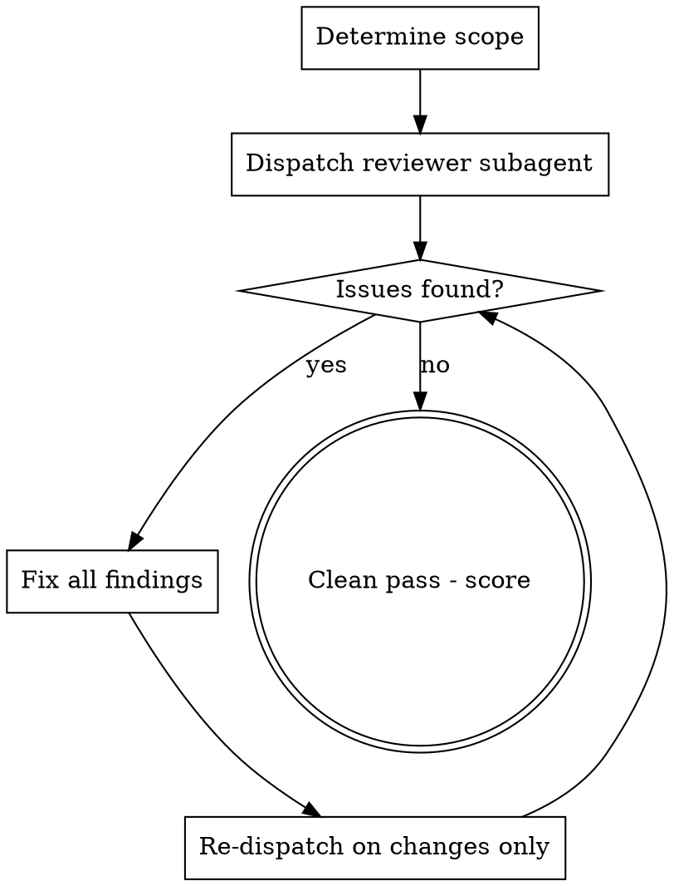

# Iterative Code Review

## Overview

Industry-standard code review powered by a reviewer subagent dispatched from the `superpowers:requesting-code-review` prompt template. Reviews against Google Engineering Practices, Clean Code (Robert C. Martin), SOLID principles, Martin Fowler's code smells, and testing standards from Google SWE Book, Kent Beck, and Microsoft. Iterates until clean.

<HARD-GATE>
This skill REQUIRES `superpowers` to be installed. If not available, tell the user:
"Install superpowers first: `/plugin marketplace add obra/superpowers` then `/plugin install superpowers@superpowers-dev`"
Do NOT proceed without it.
</HARD-GATE>

## Security Audit Gate

<HARD-GATE>
**BEFORE reviewing, check if changes are security-related** (auth, crypto, input validation, API endpoints, sessions, secrets, dependencies — see `iterative-security-audit` for the full list). If yes AND the security audit has not already run in this invocation chain, **STOP** — invoke the security audit first. It chains into code review with `AUDIT_COMPLETE` in context.

If the security audit already ran (look for `AUDIT_COMPLETE` in the invocation context), proceed normally.
</HARD-GATE>

## Scope Detection


```dot
digraph scope {
    "Start" [shape=doublecircle];
    "Uncommitted changes?" [shape=diamond];
    "Review diff" [shape=box];
    "Recent branch commits?" [shape=diamond];
    "Review branch" [shape=box];
    "User specified?" [shape=diamond];
    "Review specified" [shape=box];
    "Ask user" [shape=box];

    "Start" -> "Uncommitted changes?";
    "Uncommitted changes?" -> "Review diff" [label="yes"];
    "Uncommitted changes?" -> "Recent branch commits?" [label="no"];
    "Recent branch commits?" -> "Review branch" [label="yes"];
    "Recent branch commits?" -> "User specified?" [label="no"];
    "User specified?" -> "Review specified" [label="yes"];
    "User specified?" -> "Ask user" [label="no"];
}
```

1. `git diff` + `git diff --staged` for uncommitted changes
2. `git log` for branch commits vs base
3. User-specified scope
4. If ambiguous: **ask the user** — never guess

## Review Process


```dot
digraph review {
    "Determine scope" [shape=box];
    "Dispatch reviewer subagent" [shape=box];
    "Issues found?" [shape=diamond];
    "Fix all findings" [shape=box];
    "Re-dispatch on changes only" [shape=box];
    "Clean pass - score" [shape=doublecircle];

    "Determine scope" -> "Dispatch reviewer subagent";
    "Dispatch reviewer subagent" -> "Issues found?";
    "Issues found?" -> "Fix all findings" [label="yes"];
    "Issues found?" -> "Clean pass - score" [label="no"];
    "Fix all findings" -> "Re-dispatch on changes only";
    "Re-dispatch on changes only" -> "Issues found?";
}
```

### How to Dispatch

Superpowers has no named reviewer agent — `superpowers:code-reviewer` was removed in
superpowers v5.1.0 and replaced by a prompt template. Dispatching it fails with an
unknown agent type.

**1. Load the template.** Invoke `superpowers:requesting-code-review`, then **Read**
`<that skill's announced base directory>/code-reviewer.md`. Invoking the skill does not
load the template — its `SKILL.md` only links to it. Skipping the Read leaves you
improvising a reviewer prompt from memory.

Ignore that skill's "Note Minor issues for later" guidance — the no-deferral rule in
Iteration Rules below overrides it.

**2. Resolve the checklist paths to literal absolute strings**, against the base directory
announced when **this** skill (`necturalabs:iterative-code-review`) loaded — NOT the
superpowers skill's, which was announced more recently and does not contain them:

- `<necturalabs:iterative-code-review base>/references/review-checklist.md`
- `<necturalabs:iterative-code-review base>/references/testing-rules.md`
- `<necturalabs:iterative-code-review base>/references/comment-checklist.md`

A subagent receives literal text. It cannot resolve a placeholder, and it cannot resolve a
path relative to a skill it never loaded.

**3. Dispatch a `general-purpose` subagent** with the template placeholders filled. Every
row below goes into the prompt as literal text — the subagent resolves nothing:

| Template placeholder | Fill with |
|---|---|
| `[DESCRIPTION]` | What was implemented |
| `[PLAN_OR_REQUIREMENTS]` | What it should do, **plus** "review against the checklists at" the three absolute paths from step 2 — this is what makes the reviewer apply OUR standards instead of the template's defaults — **plus** the verification demand below |
| `[BASE_SHA]` | Scope start commit, per Scope Detection above |
| `[HEAD_SHA]` | `git rev-parse HEAD` |

**Committed scope** fills all four rows and leaves the template's git-range block intact.

**Uncommitted scope** does not. The template renders `git diff [BASE_SHA]..[HEAD_SHA]`
unconditionally, and for uncommitted work both SHAs are `HEAD` — the reviewer diffs
`HEAD..HEAD`, sees nothing, and returns a clean pass. **Replace that git-range block
outright**: state that the changes are uncommitted, and give the reviewer bare `git diff`
and `git diff --staged`. Do not fill the SHA rows and then tell the reviewer to ignore
them — that leaves two contradicting instructions in one prompt.

**Verification demand — append to `[PLAN_OR_REQUIREMENTS]`.** Every failure mode here is
silent: an empty diff, an unread template, or a dead checklist path each yield a confident,
clean, well-formatted review. So require the reviewer to report, in its output, the diff
stat it actually saw and confirmation that it read all three checklist files. It cannot go
in the template's Output Format section, which is fixed.

**A clean pass over an empty diff is a failed dispatch, not a clean review.** Do not accept
it and do not re-send the same prompt — an identically-derived prompt reproduces the
identical empty diff forever. Re-derive the scope per Scope Detection above, fix what was
wrong (usually an uncommitted scope filled as a SHA range), and dispatch the corrected
prompt. That retry does not consume an iteration, but only a *corrected* prompt may be
retried, and only once: if the diff is still empty, stop and tell the user there is nothing
to review.

## Review Checklist (Summary)

Full detailed checklist: `references/review-checklist.md`

| Category | Source | Key Checks |
|----------|--------|------------|
| Design & Architecture | Google, SOLID | SRP, OCP, LSP, ISP, DIP, Law of Demeter |
| Complexity | McCabe, SonarQube | Cyclomatic <10, Cognitive <15, Nesting <3, Params <4 |
| Code Smells | Fowler, Refactoring.Guru | Bloaters, OO abusers, change preventers, dispensables, couplers |
| Naming | Clean Code, Google | Descriptive, unambiguous, consistent vocabulary |
| Functions | Clean Code | Small, one thing, no side effects, no flag args |
| Error Handling | Clean Code, OWASP | No swallowed exceptions, specific catches, proper cleanup |
| Testing | Google SWE, Kent Beck, Microsoft | See `references/testing-rules.md` |
| Comments | Ousterhout, Clean Code, per-language guides | See `references/comment-checklist.md` |
| Performance | Google, SonarQube | Resource cleanup, N+1, proper data structures |
| Concurrency | Java Concurrency Checklist | Protected shared state, no deadlocks, proper sync |
| DRY/KISS/YAGNI | Industry Standard | No duplication, no over-engineering, no speculation |
| Style | Google/Airbnb Guides | Follow project conventions, no mixed style+logic PRs |
| API Design | Google API Guide | Backward compat, proper HTTP, consistent errors |

## Testing Rules (Summary)

Full detailed rules: `references/testing-rules.md`

**Critical rules the agent MUST follow when writing or reviewing tests:**

1. **Test YOUR code's logic, not external libraries/services** — mock externals at boundaries
2. **Reuse existing codebase helpers** — never fabricate parallel implementations
3. **Every test must be able to fail** — no tautological assertions
4. **No logic in tests** — use literal expected values, no loops/conditionals
5. **Test behavior through public APIs** — never break encapsulation
6. **One behavior per test** — if name has "and", split it
7. **Arrange-Act-Assert** — clear separation, one Act per test
8. **Don't mock what you don't own** — wrap externals, mock the wrapper
9. **Don't over-mock** — if more mocks than test logic, refactor production code
10. **Every production bug gets a regression test** — a new test, never an edit to an existing one
11. **Never assert on human-readable copy** — assert ids, roles, codes, and state, not rendered sentences
12. **Every new test must be observed failing** for its stated reason before it counts as passing
13. **Never encode a known bug as expected behavior** — fix the defect instead
14. **Never weaken a test to get green** — flag relaxed assertions, widened tolerances, new skip/xfail markers, and deletions that do not name one of the four legitimate cases

## Reporting

Keep ALL output short and concise. Never overwhelm the user.

### Per-Finding Format (one line each)
```
[SEVERITY] Category: description — file:line
```

### Severities
- **CRITICAL** — Bugs, data loss, crashes. Must fix.
- **HIGH** — Design flaws, missing tests. Should fix.
- **MEDIUM** — Quality issues. Fix preferred.
- **LOW** — Style, optional improvements.
- **INFO** — Educational notes, no action needed.

## Iteration Rules

- Each iteration reviews ONLY changes since last review
- New issues from fixes = new findings
- Recurring finding after fix = escalate severity one level
- **Max 5 iterations** — summarize remaining if not clean
- Track: "Review iteration 2/5"
- **Never skip, delay, defer, or postpone ANY finding** — every finding must be fully resolved within the review scope. No TODOs, no "address in a follow-up", no "out of scope" dismissals, no "note for later". The only exception is an explicit user instruction to skip a specific finding.
- **Double-check every finding** against codebase context and online references

## Final Summary (after clean pass)

```
## Code Review: Score X/100

**Positives**
- [concise bullet]
- [concise bullet]

**Negatives**
- [concise bullet]

**Informational**
- [optional notes]
```

Score guide: 90-100 excellent, 70-89 good, 50-69 needs work, <50 significant issues.

## Anti-Laziness Rules

- **Never substitute a manual scan for this skill** — reading the diff yourself and saying "looks clean" is not a code review. Invoke this skill.
- **Never say "looks good" without checking every file**
- **Never skip a category** from the checklist
- **Never mark a finding as LOW to avoid fixing it** — severity must reflect actual impact
- **If unsure about a finding, ASK the user** — don't guess or skip
- **Verify findings in the actual code** — don't report phantom issues
- **Never rationalize deferral** — "we can fix this later", "out of scope", "low priority for now" are all unacceptable. Fix it or get explicit user approval to skip
