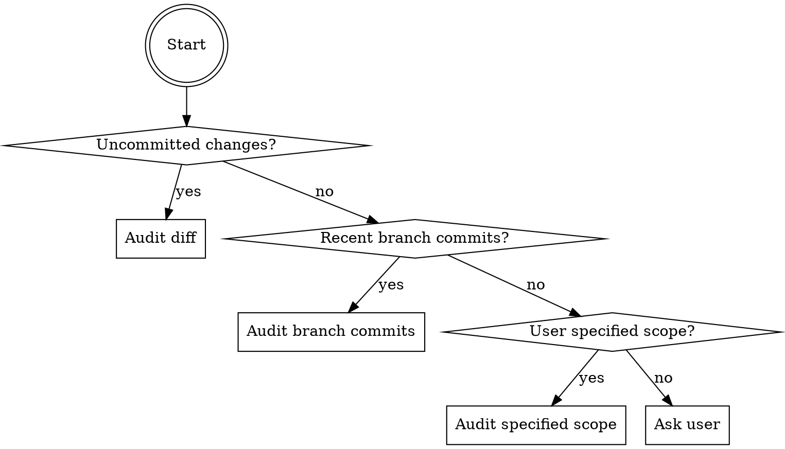
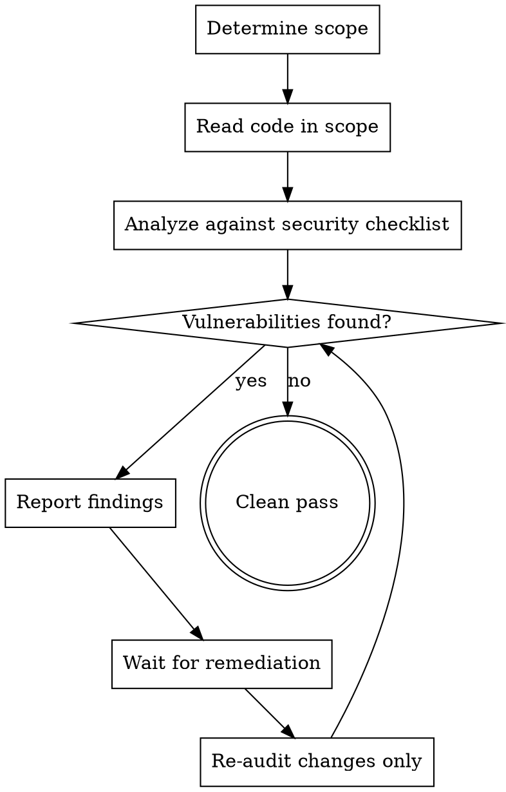

# Iterative Security Audit

## Overview

Perform thorough, iterative security audits that continue until all vulnerabilities are resolved and a clean pass is achieved. Automatically infers audit scope from context.

## Scope Detection



1. Check `git diff` and `git diff --staged` for uncommitted changes
2. If none, check `git log` for recent commits on current branch vs base branch
3. If user specified files or directories, use that scope
4. If ambiguous, ask: "Should I audit recent changes or the full codebase?"

## Audit Process



## Security Checklist

| Category | What to Check |
|----------|---------------|
| **Injection** | SQL injection, command injection, LDAP injection, template injection, header injection |
| **XSS** | Reflected, stored, and DOM-based XSS; unsanitized output; missing encoding |
| **Authentication** | Weak password handling, missing MFA, insecure session management, credential storage |
| **Authorization** | Missing access controls, IDOR, privilege escalation, BOLA, broken function-level access |
| **Data Exposure** | Secrets in code/config, verbose error messages, sensitive data in logs, PII leaks |
| **Cryptography** | Weak algorithms (MD5/SHA1 for security), hardcoded keys, missing encryption at rest/in transit |
| **Input Validation** | Missing validation, insufficient sanitization, type coercion abuse, path traversal |
| **Deserialization** | Unsafe deserialization, prototype pollution, arbitrary object instantiation |
| **Dependencies** | Known CVEs, outdated packages, unnecessary dependencies, typosquatting risk |
| **Configuration** | Debug mode in production, permissive CORS, missing security headers, default credentials |
| **Rate Limiting** | Missing rate limits on auth endpoints, brute-force vectors, API abuse surfaces |
| **File Handling** | Unrestricted upload types/sizes, path traversal in file ops, insecure temp files |

## Reporting Format

For each finding:

```
**[SEVERITY] OWASP Category: Brief description**
File: path/to/file.ext:line
Vulnerability: What's wrong and how it can be exploited
Remediation: How to fix (with code example when helpful)
CWE: CWE-XXX (if applicable)
```

Severities:
- **CRITICAL** — Actively exploitable, immediate risk (RCE, SQLi, auth bypass)
- **HIGH** — Exploitable with moderate effort (XSS, IDOR, data exposure)
- **MEDIUM** — Defense-in-depth gap (missing headers, weak crypto, verbose errors)
- **LOW** — Hardening opportunity (missing rate limits, informational leaks)

## Clean Pass Criteria

A clean pass requires:
- Zero CRITICAL or HIGH findings
- All MEDIUM findings acknowledged or remediated
- LOW findings documented for future hardening

Report: **"Security audit clean — no vulnerabilities found"** when complete.

## Iteration Rules

- Each iteration audits ONLY the remediation changes, not the full scope again
- New vulnerabilities introduced by fixes count as new findings
- Maximum 5 iterations — if not clean by then, summarize remaining issues and stop
- Track iteration count: "Security audit iteration 2/5"
- If a fix introduces a NEW critical vulnerability, flag it immediately — do not wait for next iteration
- If the same vulnerability reappears after remediation, escalate its severity one level

## Key Principles

- **Assume hostile input** — All external data is untrusted until validated
- **Defense in depth** — Multiple layers of protection, never a single point of failure
- **Least privilege** — Grant minimum permissions necessary
- **Fail secure** — Errors deny access by default, never grant it
- **No security by obscurity** — Security must not depend on hidden implementation details
