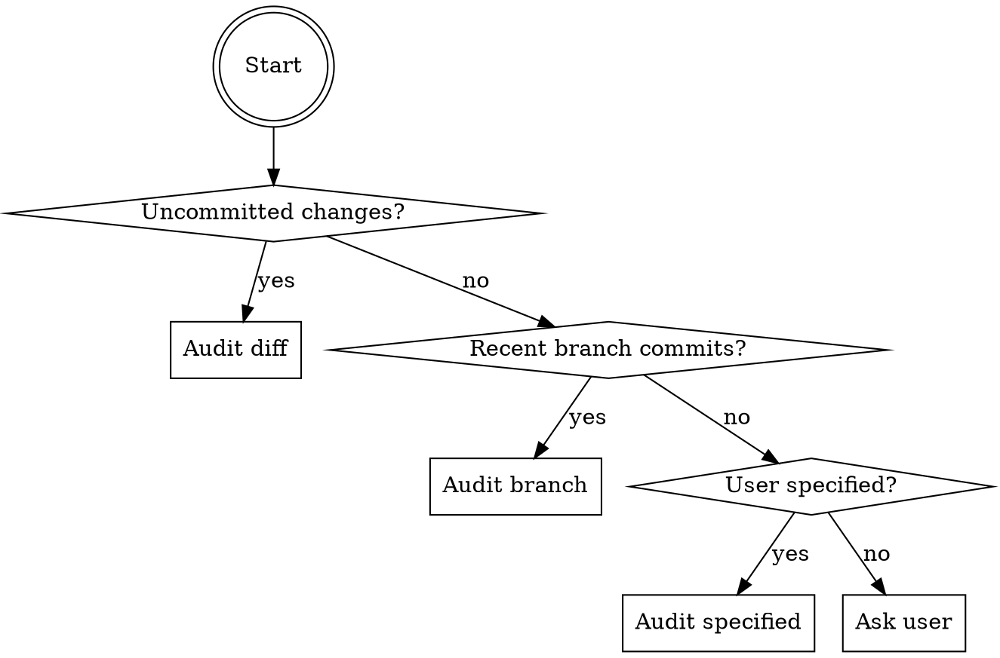
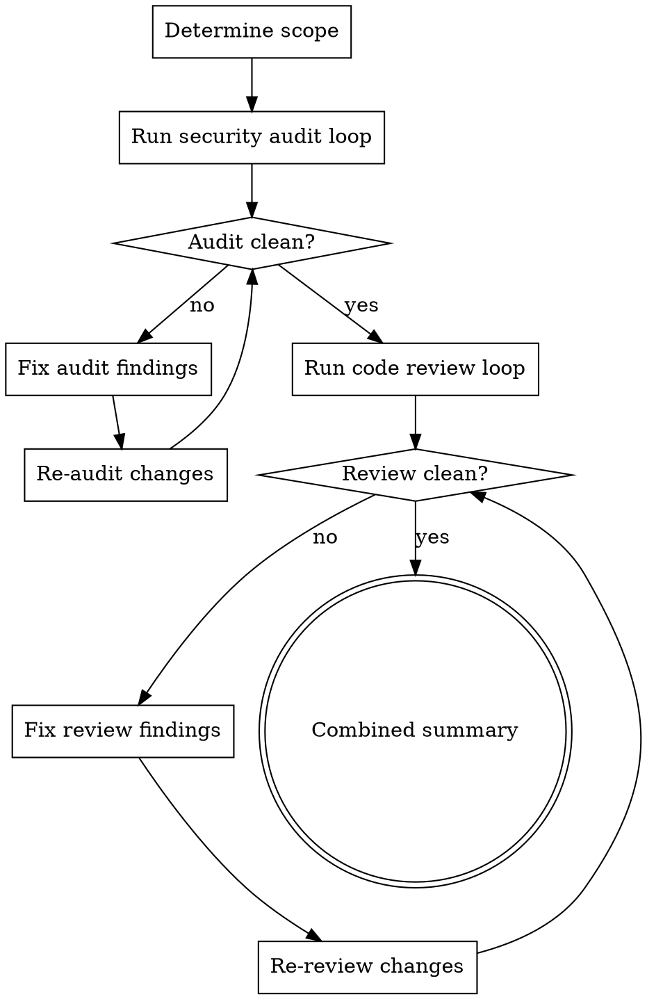

# Iterative Security Audit

## Overview

Security audit against OWASP Top 10, CWE/SANS Top 25, NIST SSDF, and CERT Secure Coding Standards. All findings must be verified against online references and codebase context. After the audit loop completes, a full code review loop runs on all changes. Only after BOTH loops are clean does the user get a summary.

<HARD-GATE>
This skill REQUIRES `superpowers` to be installed. If not available, tell the user:
"Install superpowers first: `/plugin marketplace add obra/superpowers` then `/plugin install superpowers@superpowers-dev`"
Do NOT proceed without it.
</HARD-GATE>

## Scope Detection



1. `git diff` + `git diff --staged` for uncommitted changes
2. `git log` for branch commits vs base
3. User-specified scope
4. If ambiguous: **ask the user** — never guess

## Full Process



**After security audit loop completes → invoke `necturalabs:iterative-code-review` on ALL changes (including audit remediations) with full context.**

## Security Checklist (Summary)

Full detailed checklist: `references/security-checklist.md`

### OWASP Top 10 (2021)

| Category | Severity | Key CWEs |
|----------|----------|----------|
| A01: Broken Access Control | Critical | CWE-200, 352, 862, 863, 639, 22 |
| A02: Cryptographic Failures | Critical | CWE-259, 327, 328, 330, 916 |
| A03: Injection | Critical | CWE-79, 89, 78, 94 |
| A04: Insecure Design | High | CWE-209, 522, 434 |
| A05: Security Misconfiguration | High | CWE-16, 611, 942 |
| A06: Vulnerable Components | High | CWE-1104 |
| A07: Auth Failures | High | CWE-287, 384, 307, 798 |
| A08: Integrity Failures | High | CWE-502, 829, 915 |
| A09: Logging Failures | Medium | CWE-778, 532 |
| A10: SSRF | High | CWE-918 |

### Additional Categories (ASVS, NIST, CERT, Microsoft SDL)

| Category | Source | Key Checks |
|----------|--------|------------|
| Session Management | ASVS V7, OWASP SCP | Entropy, timeout, fixation, CSRF tokens |
| API Security | ASVS V4 | Auth, rate limiting, JWT, GraphQL depth |
| Secure Communication | ASVS V12 | TLS 1.2+, HSTS, cipher suites |
| Configuration & Secrets | ASVS V13 | Secret managers, no debug in prod |
| Supply Chain | NIST SSDF, Microsoft SDL | SBOM, dependency scanning, code signing |
| Memory Safety | CERT, CWE | Overflow, use-after-free, format strings |

### CWE/SANS Top 25 (2025) — Top 10

| Rank | CWE | Weakness | KEV CVEs |
|------|-----|----------|----------|
| 1 | CWE-79 | Cross-site Scripting | 7 |
| 2 | CWE-89 | SQL Injection | 4 |
| 3 | CWE-352 | CSRF | 0 |
| 4 | CWE-862 | Missing Authorization | 0 |
| 5 | CWE-787 | Out-of-bounds Write | 12 |
| 6 | CWE-22 | Path Traversal | 10 |
| 7 | CWE-416 | Use After Free | 14 |
| 8 | CWE-125 | Out-of-bounds Read | 3 |
| 9 | CWE-78 | OS Command Injection | 20 |
| 10 | CWE-94 | Code Injection | 7 |

## How to Audit

For each file in scope:
1. Read the code
2. Check against EVERY category in `references/security-checklist.md`
3. For each potential finding, **verify it's real** — check codebase context, look for existing mitigations
4. If unsure whether something is a vulnerability: **ASK the user** — never skip
5. Cross-reference CWE IDs for accurate classification
6. Check online for latest guidance if the pattern is ambiguous

## After Audit Loop → Code Review Loop

When the audit loop is clean, dispatch `necturalabs:iterative-code-review` with:
- Include `AUDIT_COMPLETE` in the invocation context so the code-review security gate does not loop back
- Scope = ALL changes made during the security audit (remediations)
- Full context loaded (re-read changed files)
- The code review runs its own iterative loop until clean

Only after BOTH loops complete, present the combined summary.

## Reporting

Keep ALL output short and concise.

### Per-Finding Format
```
[SEVERITY] CWE-XXX Category: description — file:line
  Remediation: [one-line fix guidance]
```

### Severities
- **CRITICAL** — Actively exploitable (RCE, SQLi, auth bypass). Immediate fix.
- **HIGH** — Exploitable with effort (XSS, IDOR, data exposure). Must fix.
- **MEDIUM** — Defense-in-depth gap (missing headers, weak crypto). Should fix.
- **LOW** — Hardening opportunity (verbose errors, rate limits). Document.
- **INFO** — Educational note, no action needed.

## Iteration Rules

- Each iteration audits ONLY remediation changes
- New vulnerabilities from fixes = new findings
- Recurring vulnerability after fix = escalate severity
- **Max 5 iterations per loop** (audit and review each)
- Track: "Security audit iteration 2/5"
- If a fix introduces a NEW critical vulnerability: **flag immediately**
- **Never skip, delay, or postpone ANY finding** no matter how small
- **Double-check every finding** against codebase and online references

## Combined Summary (after BOTH loops clean)

```
## Security Audit: Score X/100
## Code Review: Score Y/100

**Positives**
- [concise bullet]

**Negatives**
- [concise bullet]

**Informational**
- [optional notes]

**Changes Made**
- [what was fixed, one line each]
```

Security score: 90-100 hardened, 70-89 solid, 50-69 gaps exist, <50 significant risk.

## Key Principles

- **Assume hostile input** — all external data untrusted
- **Defense in depth** — multiple layers, no single point of failure
- **Least privilege** — minimum permissions needed
- **Fail secure** — errors deny access, never grant
- **No security by obscurity**

## Anti-Laziness Rules

- **Check EVERY OWASP category** — don't stop at the first finding
- **Verify every finding is real** — no phantom issues
- **If unsure, ASK the user** — never skip or guess
- **Cross-reference CWE IDs** for accurate classification
- **Check online for latest vulnerability patterns** when ambiguous
- **Never mark a finding as LOW to avoid work** — severity = actual risk
