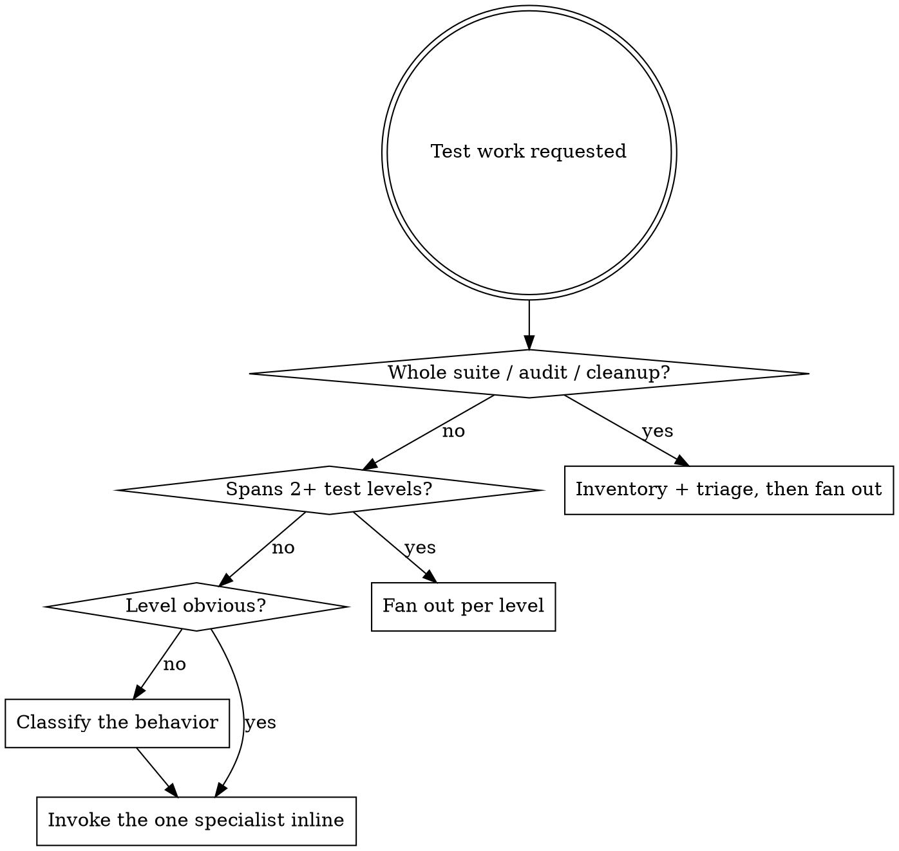

# Test Manager

## Overview

Owns a project's automated tests as a portfolio. Decides which level each behavior belongs at,
routes the work to the matching specialist skill, triages defects in the existing suite, and
verifies the whole suite before the work is called done.

Three specialists do the authoring:

| Skill | Owns |
|-------|------|
| `necturalabs:unit-test-manager` | One unit in one process, no I/O. The bulk of the suite. |
| `necturalabs:integration-test-manager` | Our code against a real collaborator — DB, HTTP, queue, filesystem. |
| `necturalabs:e2e-test-manager` | A user journey through the running system. |

Full taxonomy, classification rules, and the triage catalogue: `references/test-taxonomy.md`
The six house rules below are duplicated in every skill in this family so each is usable standalone —
verbatim except where a level inserts a clause naming its own failure modes. The canonical copy is
`references/house-rules.md`.

## House Rules

<HARD-GATE>
1. **Test our code, never a library or framework.** Assume third-party code works. If a test would
   fail when a dependency changes its output while our code is unchanged, it is testing the
   dependency. Wrap the dependency and test our wrapper's behavior instead.
2. **Never assert on human-readable copy.** Marketing sentences, labels, error prose, formatted
   dates, currency strings, and whole rendered or serialized documents change for non-behavioral
   reasons. Assert roles, ids and `data-*` attributes, element counts, status codes, error codes and
   types, and state. When the copy genuinely IS the requirement — a legal disclaimer, a regulated
   notice, a wire-protocol constant — assert the identifier the application renders it from (the
   message key, id, or code), never a duplicated literal sentence.
3. **Every new test must be observed failing** for the reason it claims before it counts as passing.
4. **Never weaken a test to get green.** Not by relaxing an assertion, widening a tolerance,
   marking `skip`/`only`/`xfail`, or deleting it. A failing test means the code is wrong (fix the
   code) or the requirement changed (see the upsert matrix below).
5. **Never encode a known bug as expected behavior.** If writing a test reveals a defect, fix the
   defect. A green test that pins a bug in place is worse than no test.
6. **You ran it, you own it.** A test that failed, flaked, or was skipped in a run you performed is
   yours to deal with. The only question is whether you fix it or report it — never whether to
   mention it. Fix it in the current work when it sits in what you changed; fix it in its own commit
   when it is small and self-contained, which a flaky or skipped test almost always is. Report it,
   with file:line and how big the fix looks, when fixing would swamp the intended change, when the
   problem spans the whole suite, or when the failure exposes a bug in untested or legacy code whose
   current behavior may be load-bearing — there, establish coverage before changing what you cannot
   verify. "Different module", "predates my change", "unrelated to this task"
   and "out of scope" are never reasons to stay silent, and rarely reasons not to fix. Dismissing it
   requires establishing it is not a defect, and citing the evidence for that.
</HARD-GATE>

## Routing

**Single level → invoke that specialist directly, in this context.** Do not dispatch a subagent to
cover one function. Orchestration costs a round trip and a context copy; spend it only when there is
parallel work to win.

**Default shape.** Google's ratio is roughly 70% unit / 20% integration / 10% end-to-end
(*Just Say No to More End-to-End Tests*); the SWE Book states it as 80/20 small tests to larger ones.
A change that seems to need a new E2E test almost always needs a unit test instead. Push work down
the pyramid until the level genuinely cannot observe the behavior.

## The Upsert Decision

Google's rule: strive for unchanging tests. After a test is written, it should not need to change as
the system is refactored, extended, or fixed. This matrix governs every level.

| Change | Existing tests | New tests |
|--------|----------------|-----------|
| **Pure refactoring** | unchanged. If they break, either the refactoring changed behavior or the tests were written against implementation details — fix that cause, not the assertion. | none |
| **New feature** | unchanged | add, covering the new behaviors only |
| **Bug fix** | unchanged | add a regression test, written first and observed failing |
| **Behavior change** | **the only case where editing an existing test is legitimate** | add for genuinely new behavior |

That matrix governs what a test asserts about *product* behavior. Repairing a test that is itself
defective — no assertion, tautological, asserting copy, asserting a generated query, unfailable,
flaky — is a different axis, and is always allowed regardless of what the product did. If the test
is currently failing, establish *why* before repairing it: a defective test can still be failing for
a real product reason, and repairing it green hides that. Confirm the product behavior is correct
first, then repair, then observe the repaired test fail against the broken behavior. Name the
defect from the catalogue (`references/test-taxonomy.md`) before you touch the test.

Deleting a test is legitimate in four cases: the behavior it covers no longer exists, it duplicates
another test at the same level, it is itself defective with no salvageable assertion, or the
behavior is now covered at a cheaper level and that replacement was written and observed failing
first. Say which case applies. "It was failing" and "it was slow" are never reasons to delete a test.

## Inventory and Triage

Run this whenever the scope is the suite rather than a single change.

1. **Discover.** Locate test roots, runner config, and the commands that run each level.
   Record the exact command per level — specialists need it to run their own slice.
2. **Classify.** Assign every existing test file to a level using `references/test-taxonomy.md`.
   Mislabeled tests are common: an "integration" test with every collaborator mocked is a unit test,
   and a "unit" test that opens a socket is not.
3. **Run each level once** and record failures, flakes, and skips. Re-run any suspected flake at
   least five times — more when the rate looks low — and report the measured rate, not a guess.
4. **Triage.** Catalogue defects against `references/test-taxonomy.md` — flaky, skipped, duplicated,
   obsolete, assertion-free, copy-asserting, library-testing, change-detector, unfailable.
5. **Assign.** Every triaged defect goes to the specialist that owns its level, with the same
   ownership rule attached. Nothing is filed as a follow-up.

## Dispatch Rules

When fanning out:

- **One subagent per level**, each told to load its specialist skill by name before doing anything.
- **Name the model explicitly.** Sonnet for the inventory sweep — it is a search. Opus for the
  authoring agents — test design is judgment work.
- **Assign disjoint paths.** Two agents editing the same fixtures, factories, or `conftest.py` will
  collide. Shared helper files stay under this skill's ownership; a specialist that needs one
  changed reports the change back instead of making it. Each specialist skill states this
  constraint too, so a dispatched agent sees it in the skill it actually loaded.
- **Each subagent runs only its own scoped test command.** Concurrent full-suite runs fight over
  ports, databases, snapshot files, and coverage output.
- **No subagent runs the code review.** It reports back; the review happens once, here.
- **Each subagent reports** what it added, what it updated, what it deleted and why, every defect it
  triaged, and the pass/fail output it actually saw.

## Completion Gate

<HARD-GATE>
Work is not done until all four hold:

1. The **full suite** runs once, after every specialist has reported. If a specialist ran inline in
   this context and already completed that run and the review below, gates 1 and 4 are satisfied by
   it — do not repeat either.
2. Zero failures and zero flakes, except any explicitly reported under House Rule 6 with file:line
   and a size estimate. Every skip is fixed and re-enabled, deleted under one of the four deletion
   cases with the case named, or reported the same way; a skip survives unmentioned only on an
   explicit user instruction to keep it.
3. Every new test has been observed failing for its stated reason at least once.
4. `necturalabs:iterative-code-review` runs **once** over the union of all changes. Three partial
   reviews are not a review. If the changes fall in
   `necturalabs:iterative-security-audit`'s trigger list — see its description, which is broader
   than auth and crypto — that audit runs first and chains into the review.

If that review returns findings about tests, fix them here, under these house rules. Do not
re-enter a test skill to handle review feedback — the review runs once per invocation chain, and
re-entering restarts a loop that never terminates.
</HARD-GATE>

## Rationalizations — All Rejected

Captured from agents doing this work without this skill.

| Excuse | Reality |
|--------|---------|
| "That failure predates my change" | You ran the suite and watched it fail. It is yours to fix or to report. |
| "Different module, unrelated to this task" | Relatedness is not a scope test. Ownership is. |
| "Bundling it would violate atomic-commit discipline" | Atomic commits mean a *separate commit*. They never mean a separate session. |
| "I'll flag it as a follow-up" | Flagging is the floor, not the resolution. If the fix is small — and a flaky test almost always is — it goes in its own commit now. |
| "Fixing the flake needs its own root-cause investigation" | Then do that investigation. That is the work. Report it instead only if it would genuinely swamp the change — with file:line and a size estimate. |
| "A proper fix would need an architectural change" | Then report it with file:line and how big it is, or make the smallest correct fix. Size can change fix-vs-report; it never licenses silence. |
| "The failure is deterministic, not intermittent — different problem" | Both are failing tests. Both are in scope. |
| "It's a production behavior change, outside a test-only task" | Writing a test that documents a bug is also a behavior decision, and a worse one. |
| "Adding an E2E test is faster than restructuring for a unit test" | E2E cost is paid on every CI run forever. Push it down the pyramid. |
| "The suite is too big to run" | Then run the affected levels and say exactly which you ran and which you did not. |

## Red Flags — Stop

- About to write "flagging this for a follow-up"
- About to report done without running the full suite
- About to dispatch a subagent for a single file's worth of tests
- About to let a dispatched subagent run the whole suite instead of its own slice
- About to skip the code review because "it's only tests"
- Counting a test as a regression test without having watched it fail on the unfixed code
