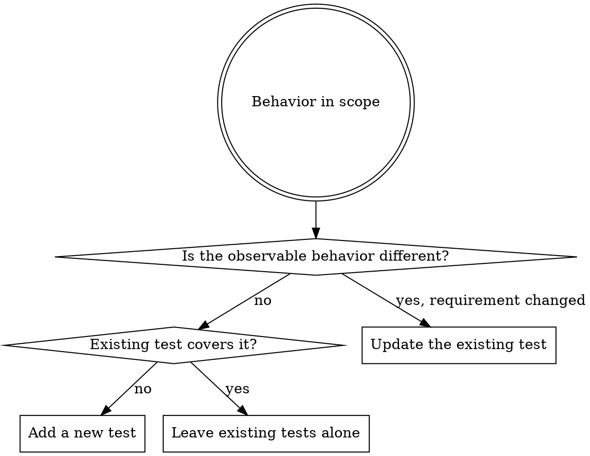

# Unit Test Manager

## Overview

Authors and maintains unit tests: one unit, one process, no I/O. The decision that matters most is
not how to write a new test — it is whether this change should produce a new test, edit an existing
one, or leave the suite alone.

## Is This the Right Skill?

| The behavior needs | Skill |
|--------------------|-------|
| Only our code, in one process, no I/O | this one |
| A real database, HTTP server, queue, or filesystem | `necturalabs:integration-test-manager` |
| A user driving the assembled system | `necturalabs:e2e-test-manager` |
| More than one of the above, or a suite-wide audit | `necturalabs:test-manager` |

Solitary and sociable tests are both unit tests. Replacing collaborators with doubles is a style
choice; touching a real out-of-process dependency is what makes a test an integration test.

## House Rules

<HARD-GATE>
1. **Test our code, never a library or framework.** Assume third-party code works. If a test would
   fail when a dependency changes its output while our code is unchanged, it is testing the
   dependency. Wrap the dependency and test our wrapper's behavior instead.
2. **Never assert on human-readable copy.** Marketing sentences, labels, error prose, formatted
   dates, currency strings, and whole rendered or serialized documents change for non-behavioral
   reasons. Assert roles, ids and `data-*` attributes, element counts, status codes, error codes and
   types, and state. When the copy genuinely IS the requirement — a legal disclaimer, a regulated
   notice, a wire-protocol constant — assert the identifier the application renders it from (the
   message key, id, or code), never a duplicated literal sentence.
3. **Every new test must be observed failing** for the reason it claims before it counts as passing.
4. **Never weaken a test to get green.** Not by relaxing an assertion, widening a tolerance,
   marking `skip`/`only`/`xfail`, or deleting it. A failing test means the code is wrong (fix the
   code) or the requirement changed (see the upsert matrix below).
5. **Never encode a known bug as expected behavior.** If writing a test reveals a defect, fix the
   defect. A green test that pins a bug in place is worse than no test.
6. **You ran it, you own it.** A test that failed, flaked, or was skipped in a run you performed is
   yours to deal with. The only question is whether you fix it or report it — never whether to
   mention it. Fix it in the current work when it sits in what you changed; fix it in its own commit
   when it is small and self-contained, which a flaky or skipped test almost always is. Report it,
   with file:line and how big the fix looks, when fixing would swamp the intended change, when the
   problem spans the whole suite, or when the failure exposes a bug in untested or legacy code whose
   current behavior may be load-bearing — there, establish coverage before changing what you cannot
   verify. "Different module", "predates my change", "unrelated to this task"
   and "out of scope" are never reasons to stay silent, and rarely reasons not to fix. Dismissing it
   requires establishing it is not a defect, and citing the evidence for that.
</HARD-GATE>

## Workflow

1. **Discover the project's conventions before writing anything.** Test root and layout, file and
   function naming, the runner command, the assertion library, and the existing helpers, builders,
   factories, and custom matchers. Reuse them. Never fabricate a parallel helper that duplicates one
   the codebase already has. Per-ecosystem conventions: `references/framework-conventions.md`
2. **Find what already covers this behavior.** Search by behavior, not by filename — the coverage
   may live in a differently named file.
3. **Decide add / update / leave** using the upsert matrix below.
4. **Write the test**, following `references/unit-test-rules.md`.
5. **Observe it fail.** For a bug fix, write the test first and watch it fail against the unfixed
   code. For code that already works, break the production line the test claims to cover, confirm
   the test fails for that reason, then restore. A test never observed failing is not yet a test.
6. **Run the unit-level command** and read the actual output. Report what you ran and what it
   printed. When dispatched by `necturalabs:test-manager`, run only that command — never the full
   suite, which collides with the other specialists running concurrently.
7. **Triage anything else the run surfaced** under House Rule 6, classifying each defect
   against `../test-manager/references/test-taxonomy.md` — flaky, skipped, assertion-free,
   unfailable, tautological, copy-asserting, library-testing, change-detector, duplicated,
   obsolete, mislabeled, excessive setup.

### When dispatched by `necturalabs:test-manager`

- Run only your level's command, never the full suite.
- Do not edit shared fixtures, factories, `conftest.py`, or any helper file outside your assigned
  paths — another specialist may be editing it right now. Report the change you need instead.
- Do not run the code review. Report back; the orchestrator runs it once over everything.

## The Upsert Decision

Google's rule: strive for unchanging tests. After a test is written, it should not need to change as
the system is refactored, extended, or fixed.

| Change | Existing tests | New tests |
|--------|----------------|-----------|
| **Pure refactoring** | unchanged. If they break, either the refactoring changed behavior or the tests were written against implementation details — fix that cause, not the assertion. | none |
| **New feature** | unchanged | add, covering the new behaviors only |
| **Bug fix** | unchanged | add a regression test, written first and observed failing |
| **Behavior change** | **the only case where editing an existing test is legitimate** | add for genuinely new behavior |

That matrix governs what a test asserts about *product* behavior. Repairing a test that is itself
defective — no assertion, tautological, asserting copy, asserting a generated query, unfailable,
flaky — is a different axis, and is always allowed regardless of what the product did. If the test
is currently failing, establish *why* before repairing it: a defective test can still be failing for
a real product reason, and repairing it green hides that. Confirm the product behavior is correct
first, then repair, then observe the repaired test fail against the broken behavior. Name the
defect from the catalogue (`../test-manager/references/test-taxonomy.md`) before you touch the test.

Deleting a test is legitimate in four cases: the behavior it covers no longer exists, it duplicates
another test at the same level, it is itself defective with no salvageable assertion, or the
behavior is now covered at a cheaper level and that replacement was written and observed failing
first. Say which case applies. "It was failing" and "it was slow" are never reasons to delete a test.

## What Belongs in a Unit Test

Full rules with sources: `references/unit-test-rules.md`

| Rule | Short form |
|------|------------|
| Test behaviors, not methods | One test per guarantee, not per function. "and" in the name means split it. |
| Test through the public API | Never reach into private state. An untestable private needs extracting, not exposing. |
| Test state, not interactions | Assert the result or the resulting state. Interaction assertions only where the interaction *is* the behavior — an email sent, a record saved. |
| Prefer real, then fake, then stub | Use the real collaborator when it is fast and deterministic; a fake when it is not; stub only to reach a specific state; interaction assertions last. |
| Narrow assertions | Assert the properties the behavior guarantees, not the whole object graph. A wide assertion fails on unrelated changes and does not say what broke. |
| No logic in tests | No loops, conditionals, arithmetic, or string building to produce an *expected* value. Parsing the *actual* output to assert on its fields is fine, and is the right alternative to asserting a whole rendered string. |
| DAMP over DRY | Duplication is acceptable when it makes a test self-evident. Relevant setup stays in the test body; only irrelevant boilerplate moves out. |
| One act per test | One call to the code under test, with a clearly separated arrange and assert. |
| Names describe behavior | Unit, scenario, expected outcome. Never `test1`, `testStuff`. |
| Deterministic by construction | Inject the clock, the random source, and the id generator. Never assert on wall-clock time. |
| Don't test the trivial | No tests for getters, DTOs, or generated code. Test the branches, calculations, validation, error paths, and state transitions. |

## Rationalizations — All Rejected

Captured from agents writing unit tests without this skill.

| Excuse | Reality |
|--------|---------|
| "I verified the expected values against the library's real output first" | That is what makes it a library test. It pins the library's current version, not our behavior. |
| "Asserting the whole rendered string avoids logic in the test" | There is a third option: parse the output and assert on structure, roles, and attributes. |
| "The exact copy is part of the contract" | Assert the message key or id. The sentence is not the contract; the identifier is. |
| "This test documents a real finding" (asserting buggy behavior passes) | It also guards the bug against being fixed. Fix the defect instead. |
| "The expected value mirrors the implementation's own call, but it still fails if the default changes" | If the expected value is produced by the code under test, the test cannot fail for the reason that matters. |
| "It's a boundary test, so it counts as the regression test" | Run it against the unfixed code. If it passed, it is not the regression test. |
| "Full coverage of the module was requested" | Coverage is a diagnostic. Tests with no failure mode raise the number and lower the value. |
| "Mocking the whole dependency was the only way to isolate" | More mock setup than test logic means the production code needs a seam, not the test more mocks. |
| "I'll add the failing-first check later" | The failing observation is the only evidence the test works. There is no later. |

## Red Flags — Stop

- An expected value copied from the output of a library, formatter, or serializer
- An assertion containing a sentence, a label, or a full document
- A test asserting the code under test's own output back at itself
- More lines of mock setup than of arrange plus assert
- Editing an existing test's expected value while fixing a bug
- Reaching for reflection, `@ts-ignore`, or a private accessor to observe state
- A new test that has never been seen red

## When Done

Report what you added, updated, and deleted with reasons; the failing observation for each new test;
the exact command run and its output; and every defect triaged along the way.

If you are running as a subagent dispatched by `necturalabs:test-manager`, stop here and report
back — it runs the full suite and the review once, over everything. Otherwise, including when
test-manager invoked this skill inline in your own context, run the full suite yourself and then
`necturalabs:iterative-code-review` over the changes — preceded by
`necturalabs:iterative-security-audit` when the changes fall in that skill's trigger list (see its
description; it is broader than auth and crypto), since it chains into the review. That run satisfies the orchestrator's completion
gate rather than adding a second one. If the review returns test findings, fix them here
under these rules rather than re-entering a test skill, so the review runs once per invocation
chain.
