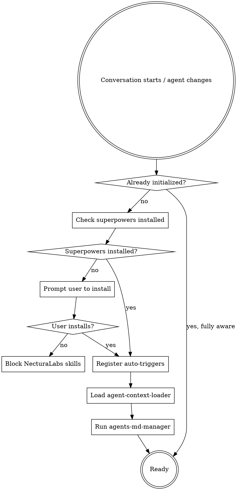
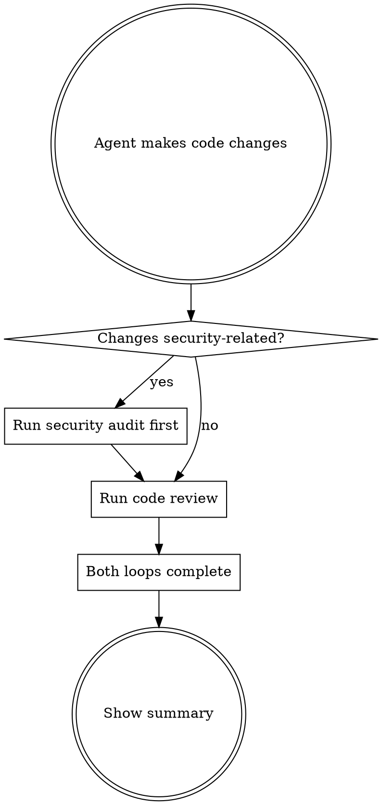

# Using NecturaLabs Skills

## Overview

Initializes the NecturaLabs skill suite. This skill runs at conversation start and after every agent change to ensure all NecturaLabs skills are active and properly configured.

<HARD-GATE>
Do NOT proceed with any work until this initialization is complete. If superpowers is not installed, block all NecturaLabs skill execution until it is.
</HARD-GATE>

## Initialization Flow



## Step 1: Verify Superpowers Dependency

NecturaLabs skills require `superpowers` to be installed. Check if the `superpowers:code-reviewer` agent is available.

If NOT installed, tell the user:
```
NecturaLabs skills require the superpowers plugin. Install it with:
  /plugin marketplace add obra/superpowers
  /plugin install superpowers@superpowers-dev
```

**Do not allow** `necturalabs:iterative-code-review` or `necturalabs:iterative-security-audit` to run without superpowers installed. Other NecturaLabs skills may run independently.

## Step 2: Register Auto-Triggers

After initialization, these triggers are active for the entire session:

### Code Review — After ANY Changes


**Code review runs automatically after every change the agent makes.** This is not optional. The agent must not skip this.

### Security Audit — When Changes Are Security-Related

Security audit auto-triggers when changes touch ANY of:
- Authentication / authorization code
- Cryptography / hashing / token generation
- Input validation / sanitization
- Database queries / ORM usage
- API endpoints / route handlers
- Session management / cookies
- File upload / download handling
- Environment variables / secrets / config
- CORS / CSP / security headers
- Dependency additions or upgrades

**Security audit takes priority over code review.** When both apply: security audit loop runs first, then code review loop runs on all changes (including audit remediations), then combined summary.

## Step 3: Load Context

Invoke `necturalabs:agent-context-loader` to load global CLAUDE.md and project AGENTS.md.

## Step 4: Run AGENTS.md Manager

Invoke `necturalabs:agents-md-manager` to create or update the project's AGENTS.md if needed.

## Available Skills

| Skill | Purpose | Auto-triggers |
|-------|---------|---------------|
| `necturalabs:iterative-code-review` | Industry-standard code review loop | After any agent changes |
| `necturalabs:iterative-security-audit` | OWASP/CWE security audit loop | When changes are security-related |
| `necturalabs:agent-context-loader` | Loads CLAUDE.md + AGENTS.md into context | On init and agent changes |
| `necturalabs:agents-md-manager` | Creates/updates project AGENTS.md | On init, when project changes |
| `necturalabs:using-necturalabs` | This skill — initializes everything | On init and agent changes |

## Skill Priority When User Asks

If NecturaLabs skills are installed and the user asks for "code review" or "security audit", invoke the NecturaLabs skill — not the default behavior or any other plugin's version. NecturaLabs skills are complementary to superpowers and layer additional standards on top.

## Re-Initialization

Re-run this initialization when:
- A new conversation begins
- A subagent is dispatched or returns
- The main agent context is switched or compressed
- The user explicitly asks to reload skills

Skip re-initialization ONLY if the current agent is already fully aware of all NecturaLabs skills and their auto-triggers are active.
