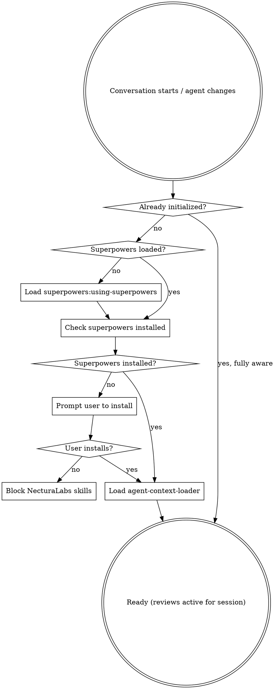
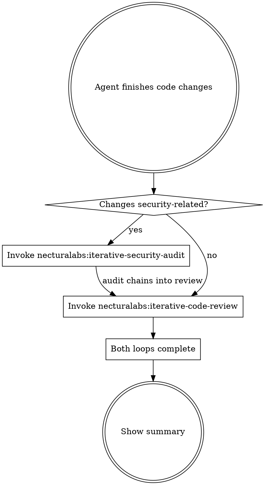

# Using NecturaLabs Skills

## Overview

Initializes the NecturaLabs skill suite. This skill runs at conversation start and after every agent change to ensure all NecturaLabs skills are active and properly configured.

<HARD-GATE>
Do NOT proceed with any work until this initialization is complete. If superpowers is not installed, block all NecturaLabs skill execution until it is.
</HARD-GATE>

## Initialization Flow



## Step 1: Ensure Superpowers Is Loaded

If `superpowers:using-superpowers` has not been invoked yet in this session, invoke it first. NecturaLabs skills build on top of superpowers and require its session initialization to be complete before proceeding.

## Step 2: Verify Superpowers Dependency

NecturaLabs skills require `superpowers` to be installed. Check if the `superpowers:code-reviewer` agent is available.

If NOT installed, tell the user:
```
NecturaLabs skills require the superpowers plugin. Install it with:
  /plugin marketplace add obra/superpowers
  /plugin install superpowers@superpowers-dev
```

**Do not allow** `necturalabs:iterative-code-review` or `necturalabs:iterative-security-audit` to run without superpowers installed. Other NecturaLabs skills may run independently.

## Step 3: Load Context

Invoke `necturalabs:agent-context-loader` to load global CLAUDE.md and project AGENTS.md.

## Ongoing: Mandatory Post-Change Reviews

<HARD-GATE>
These reviews are NOT optional. The agent MUST invoke the appropriate skill after making code changes — before committing, merging, or claiming work is done. Skipping these is never acceptable. This applies for the ENTIRE session, not just during initialization.
</HARD-GATE>

### Decision Flow — After ANY Code Changes



### When to invoke `necturalabs:iterative-code-review`

**After ANY code changes** — feature implementation, bug fixes, refactoring, test additions, config changes. No exceptions.

### When to invoke `necturalabs:iterative-security-audit` (BEFORE code review)

When changes are security-related (see the skill's description for the full trigger list). **Security audit takes priority** — it runs first and chains into code review automatically.

## Available Skills

| Skill | Purpose | When to invoke |
|-------|---------|----------------|
| `necturalabs:iterative-code-review` | Industry-standard code review loop | After any code changes, before commit/merge |
| `necturalabs:iterative-security-audit` | OWASP/CWE security audit loop | When changes touch security-sensitive code |
| `necturalabs:agent-context-loader` | Loads CLAUDE.md + AGENTS.md into context | On init and after context switches |
| `necturalabs:agents-md-manager` | Creates/updates project AGENTS.md | Manual (`/agents-md-manager`) or after plan execution |
| `necturalabs:git-workflow` | Conventional Commits + worktree isolation | When committing or starting multi-commit work |
| `necturalabs:update-plugins` | Updates all plugin marketplaces and plugins concurrently | Manual (`/update-plugins`) |
| `necturalabs:docs-manager` | Creates/maintains project docs/ with ADRs, design docs, guides | Manual (`/docs-manager`) or when user asks to document |
| `necturalabs:using-necturalabs` | This skill — initializes everything | On init and after agent handoffs |

## Skill Priority When User Asks

If NecturaLabs skills are installed and the user asks for "code review" or "security audit", invoke the NecturaLabs skill — not the default behavior or any other plugin's version. NecturaLabs skills are complementary to superpowers and layer additional standards on top.

## Re-Initialization

Re-run this initialization when:
- A new conversation begins
- A subagent is dispatched or returns
- The main agent context is switched or compressed
- The user explicitly asks to reload skills

Skip re-initialization ONLY if the current agent is already fully aware of all NecturaLabs skills and their mandatory review requirements are understood.
